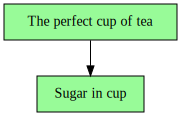

# iotaa

**It's One Thing After Another**

A simple workflow engine with semantics inspired by [Luigi](https://github.com/spotify/luigi) and tasks expressed as decorated Python functions (or methods). `iotaa` is pure Python, relies on no third-party packages, and is contained in a single module.

## Workflows

Workflows comprise:

- Assets: observable external state -- often files, but sometimes more abstract entities, e.g. file line counts, REST API responses, times of day, etc.
- Actions: imperative logic to create or otherwise "ready" assets
- Requirements: dependency relationships allowing actions to ready output assets incorporating upstream assets

## Assets

An asset (an instance of class `iotaa.Asset`) has two attributes:

1. `ref`: A value, of any type, uniquely identifying the observable state this asset represents (e.g. a POSIX filesystem path, an S3 URI, an ISO8601 timestamp)
2. `ready`: A 0-arity (no-argument) function returning a `bool` indicating whether the asset is ready to use

Create assets by calling `iotaa.asset()`.

## Tasks

A task is a decorated Python functions that `yield`s to `iotaa` its name and, depending on its type (see below), output assets and/or required tasks. *Task names must be unique within a workflow.* Following its `yield` statements, a task that readies an asset provides imperative logic for that.

`iotaa` provides three decorators to define tasks:

### `@task`

The essential workflow task, a `@task` function `yield`s, in order:

1. Its name
2. An asset -- or an asset `list`, or a `dict` mapping `str` keys to assets, or `None` -- the task is responsible for readying
3. A task-function call (e.g. `t(args)` for a task `t`) -- or a `list` or `dict` of such calls, or `None` -- required for readying its asset(s)

Statements following the final `yield` will be executed to ready the task's asset(s). If the task `yield`s requirements, execution proceeds only if required tasks' assets are all ready. The task may access those assets via references extracted by calling `iotaa.refs(t)` for a required task `t`.

### `@tasks`

A collections of other tasks. A `@tasks` task is ready when all of its required tasks are ready. It `yield`s, in order:

1. Its name
2. A task-function call (e.g. `t(args)` for task `t`) -- or a `list` or `dict` of such calls, or `None` -- that this task requires.

No statements should follow the final `yield`, as they will never execute.

### `@external`

An `@external` task represents required assets that cannot be readied by the workflow. It `yield`s, in order:

1. Its name
2. A required asset -- or an asset `list`, or a `dict` mapping `str` keys to assets, or `None` -- that must be readied by external means not under workflow control.

No statements should follow the final `yield`, as they will never execute.

For all task types, arbitrary Python statements may appear before and interspersed between the `yield` statements, but should generally not be permitted to affect external state.

## Use

### Installation

Installation via a `conda` package at [anaconda.org](https://anaconda.org/conda-forge/iotaa):

- Into an existing, activated conda environment: `conda install -c conda-forge iotaa`
- Into a new environment called `iotaa`: `conda create -n iotaa -c conda-forge iotaa`

Installation via a `pip` package at [pypi.org](https://pypi.org/project/iotaa/):

- Into an existing, activated `venv` environment: `pip install iotaa`

Installation via local source, from the `src/` directory of an `iotaa` git clone:

- Into an existing, activated `venv` environment: `pip install .`
- Into an arbitrary directory (e.g. directory to be added to `PYTHONPATH`, or path to a `venv`): `pip install --prefix /some/path .`

Integration into another package:

- Copy the `src/iotaa/__init__.py` module as `iotaa.py` to another project. No `iotaa` CLI program will be available in this case, but `iotaa.main()` can be used to create one.

### CLI Use

```
$ iotaa --help
usage: iotaa [-d] [-h] [-g] [-t] [-v] [--version] module [function] [args ...]

positional arguments:
  module
    application module name or path
  function
    task name
  args
    task arguments

optional arguments:
  -d, --dry-run
    run in dry-run mode
  -h, --help
    show help and exit
  -g, --graph
    emit Graphviz dot to stdout
  -t, --tasks
    show available tasks
  -v, --verbose
    enable verbose logging
  --version
    Show version info and exit
```

Specifying positional arguments `m f hello 88` calls task function `f` in module `m` with arguments `hello: str` and `88: int`. Positional arguments `args` are parsed with the `json` library into Python values. To support intra-run idempotence (i.e. multiple tasks may depend on the same task, but the latter will only be evaluated/executed once), JSON values parsed to Python `dict` objects will be converted to a hashable (and therefore cacheable) `dict` subtype, and `list` objects will be converted to `tuple`s. Both should be treated as read-only in `iotaa` application code.

It is assumed that `m` is importable by Python by customary means. As a convenience, if `m` is a valid absolute or relative path (perhaps specified as `m.py` or `/path/to/m.py`), its parent directory is automatically added to `sys.path` so that it can be loaded.

Given a task graph comprising any number of nodes defined in module `m`, an arbitrary subgraph may be executed by specifying the desired root function `f`: Only `f` and its children will be processed, resulting in partial execution of the potentially larger workflow graph.

The `function` argument is optional (and ignored if supplied) if the `-t` / `--tasks` option, which lists the names of task functions in `module`, is specified.

### Programmatic Use

After installation, `import iotaa` or `from iotaa import ...` to access public members. See the demo application below for example use.

### Dry-Run Mode

Use the CLI `--dry-mode` switch (or pass the `dry_run=True` argument when programmatically executing a task function) to run `iotaa` in a mode where no post-`yield` statements in `@task` bodies are executed. When applications are written such that no state-affecting statements precede the final `yield` statement, dry-run mode will report the current condition of the workflow, identifying not-ready requirements that are blocking workflow progress.

## Helpers

A number of public helper functions are available in the `iotaa` module:

| Function      | Description |
| ------------- | ----------- |
| `asset()`     | Instantiates an asset to return from a task function. |
| `graph()`     | Given the value returned by a task-function call, returns a Graphviz string representation of the task graph. |
| `logcfg()`    | Configures Python's root logger to support `logging.info()` et al. calls, which `iotaa` itself makes. It is called by the `iotaa` CLI, but is available for standalone applications with simple logging needs to call programmatically. |
| `logset()`    | Accepts a Python `Logger` object and configures `iotaa` to send all future log messages to it. |
| `refs()`      | Given the value returned by a task-function call, returns `ref` values of the assets in the same shape (e.g. `dict`, `list`) as returned by the task. |
| `run()`       | Runs a command in a subshell. |
| `runconda()`  | Runs a command in a subshell with a named conda environment activated. |
| `tasknames()` | Accepts an object (e.g. a module) and returns a list of names of  `iotaa` task members. This function is called when the `-t` / `--tasks` argument is provided to the CLI, which then prints each task name followed by, when available, the first line of its docstring.

## Development

In the base environment of a conda installation ([Miniforge](https://github.com/conda-forge/miniforge) recommended), install the [condev](https://github.com/maddenp/condev) [package](https://anaconda.org/maddenp/condev), then run `make devshell` in the root of an `iotaa` git clone. See the [condev docs](https://github.com/maddenp/condev/blob/main/README.md) for details but, in short: In the development shell created by `make devshell`, edit and test code live (either by starting a `python` REPL, or by invoking the `iotaa` CLI program), run the auto-formatter with `make format`, and run the code-quality tests with `make test`. Type `exit` to exit the development shell. (The underlying `DEV-iotaa` conda environment created by `make devshell` will persist until manually removed, so future `make devshell` invocations should be much faster than the first one, which must create the environment.)

## Notes

- Workflows can be invoked repeatedly, potentially making further progress with each invocation, depending on readiness of external requirements. Since task functions' assets are checked for readiness before their requirements are checked or their post-`yield` statements are executed, completed work is never performed twice -- unless the asset becomes not-ready via external means. For example, one might notice that an asset is incorrect, remove it, fix the workflow code, then re-run the workflow: `iotaa` would perform whatever work is necessary to re-ready the asset, but nothing more.
- For dry-run mode to work correctly, `iotaa` assumes that no statements that affect external state execute before the final `yield` statement in a task function's body.
- Currently, `iotaa` is single-threaded, so it truly is "one thing after another". Concurrent execution of mutually independent tasks may be added in future work.

## Demo

Consider the source code of the [demo application](src/iotaa/demo.py), which simulates making a cup of tea (according to [the official recipe](https://www.google.com/search?q=masters+of+reality+t.u.s.a.+lyrics)).

The first `@tasks` method defines the end result: A cup of tea, steeped, with sugar -- and a spoon to stir in the sugar:

``` python
@tasks
def a_cup_of_tea(basedir):
    # A cup of steeped tea with sugar, and a spoon.
    yield "The perfect cup of tea"
    yield [spoon(basedir), steeped_tea_with_sugar(basedir)]
```

As described above, a `@tasks` function must `yield` its name and the assets it requires: In this case, the steeped tea with sugar, and a spoon. Since this function is a `@tasks` connection, no executable statements follow the final `yield.`

The `spoon()` and `cup()` `@task` functions are straightforward:

``` python
@task
def spoon(basedir):
    # A spoon to stir the tea.
    path = Path(basedir) / "spoon"
    yield "A spoon"
    yield asset(path, path.exists)
    yield None
    path.parent.mkdir(parents=True)
    path.touch()
```

``` python
@task
def cup(basedir):
    # A cup for the tea.
    path = Path(basedir) / "cup"
    yield "A cup"
    yield asset(path, path.exists)
    yield None
    path.mkdir(parents=True)
```

They `yield` their names; the asset each is responsible for readying; and the tasks they require -- `None` in this case, since they have no requirements. Following the final `yield`, they do what is necessary to ready their assets: `spoon()` ensures that the base directory exists, then creates the `spoon` file therein; `cup()` creates the `cup` directory that will contain the tea ingredients.

Note that, while `pathlib`'s `Path.mkdir()` would normally raise an exception if the specified directory already exists (unless an `exist_ok=True` argument is supplied), the workflow need not explicitly account for this possibility because `iotaa` checks for the readiness of assets before executing code that would ready them. That is, `iotaa` will not execute the `path.mkdir()` statement if it determines that the asset represented by that directory is already ready (i.e. exists). This check is provided by the `path.exists` function supplied as the second argument to `asset()` in `cup()`.

The `steeped_tea_with_sugar()` `@task` function is next:

``` python
@task
def steeped_tea_with_sugar(basedir):
    # Add sugar to the steeped tea. Requires tea to have steeped.
    for x in ingredient(basedir, "sugar", "Sugar", steeped_tea):
        yield x
```

Two new ideas are demonstrated here.

First, a task function can call arbitrary logic to help it carry out its duties. In this case, it calls an `ingredient()` helper function defined thus:

``` python
def ingredient(basedir, fn, name, req=None):
    yield f"{name} in cup"
    path = refs(cup(basedir)) / fn
    yield {fn: asset(path, path.exists)}
    yield [cup(basedir)] + ([req(basedir)] if req else [])
    logging.info("Adding %s to cup", fn)
    path.touch()
```

This helper is called by other task functions in the workflow, too. It simulates adding an ingredient (tea, water, sugar) to the tea cup, and `yield`s values that the caller can re-`yield` to `iotaa`.

Second, `steeped_tea_with_sugar()` `yield`s (indirectly, by passing it to `ingredient()`) a requirement: Sugar is added as a last step after the tea is steeped, so `steeped_tea_with_sugar()` requires `steeped_tea()`. Note that it passes the function _name_ rather than a call (i.e. `steeped_tea` instead of `steeped_tea(basedir)`) so that it can be called at the right time by `ingredient()`.

Next up, the `steeped_tea()` function, which is more complex:

``` python
@task
def steeped_tea(basedir):
    # Give tea time to steep.
    yield "Steeped tea"
    water = refs(steeping_tea(basedir))["water"]
    steep_time = lambda x: asset("elapsed time", lambda: x)
    t = 10  # seconds
    if water.exists():
        water_poured_time = dt.datetime.fromtimestamp(water.stat().st_mtime)
        ready_time = water_poured_time + dt.timedelta(seconds=t)
        now = dt.datetime.now()
        ready = now >= ready_time
        remaining = int((ready_time - now).total_seconds())
        yield steep_time(ready)
    else:
        ready = False
        remaining = t
        yield steep_time(False)
    yield steeping_tea(basedir)
    if not ready:
        logging.warning("Tea needs to steep for %ss", remaining)
```

Here, the asset being `yield`ed is more abstract: It represents a certain amount of time having passed since the boiling water was poured over the tea. (The observant reader will note that 10 seconds is insufficient, if handy for a demo. Try 3 minutes for black tea IRL.) The path to the `water` file is located by calling `refs()` on the return value of `steeping_tea()` and taking the item with key `water` (because `ingredient()` `yield`s its assets as `{fn: asset(path, path.exists)}`, where `fn` is the filename, e.g. `sugar`, `teabag`, `water`.) If the water was poured long enough ago, `steeped_tea` is ready; if not, it should be during some future execution of this workflow. Note that the executable code following the final `yield` only logs information: There's nothing this task can do to ready its asset (time passed): It can only wait.

Note the statement

``` python
water = refs(steeping_tea(basedir))["water"]
```

Here, `steeped_tea()` needs to know the path to the `water` file, and obtains it by calling the `steeping_tea()` task, extracting the references to its assets with `iotaa`'s `refs()` function, and selecting the `"water"` item's reference, which is the path to the `water` file. This is a useful way to delegate ownership of knowledge about assets to those assets, but note that the function call `steeping_tea(basedir)` effectively transfers workflow control to that task. This can be seen in the execution traces shown later in this document, where the task responsible for the `water` file (as well as its requirements) are evaluated before the steep-time task.

The `steeping_tea()` and `teabag()` functions are again straightforward `@task`s, leveraging the `ingredient()` helper:

``` python
@task
def steeping_tea(basedir):
    # Pour boiling water over the tea. Requires teabag in cup.
    for x in ingredient(basedir, "water", "Boiling water", teabag):
        yield x
```

``` python
@task
def teabag(basedir):
    # Place tea bag in the cup. Requires box of teabags.
    for x in ingredient(basedir, "teabag", "Teabag", box_of_teabags):
        yield x
```

Finally, we have this workflow's only `@external` task, `box_of_teabags()`. The idea here is that this is something that simply must exist (think: someone must have simply bought the box of teabags at the store), and no action by the workflow can create it. Unlike other task types, the `@external` `yield`s, after its name, only the _assets_ that it represents. It `yield`s no task requirements, and has no executable statements to ready the asset:

``` python
@external
def box_of_teabags(basedir):
    path = Path(basedir) / "box-of-teabags"
    yield f"Box of teabags {path}"
    yield asset(path, path.exists)
```

Let's run this workflow with the `iotaa` command-line tool, requesting that the workflow start with the `a_cup_of_tea` task:

```
% iotaa iotaa.demo a_cup_of_tea ./teatime
[2023-10-19T11:49:43] INFO    The perfect cup of tea: Initial state: Not Ready
[2023-10-19T11:49:43] INFO    The perfect cup of tea: Checking requirements
[2023-10-19T11:49:43] INFO    A spoon: Initial state: Not Ready
[2023-10-19T11:49:43] INFO    A spoon: Checking requirements
[2023-10-19T11:49:43] INFO    A spoon: Requirement(s) ready
[2023-10-19T11:49:43] INFO    A spoon: Executing
[2023-10-19T11:49:43] INFO    A spoon: Final state: Ready
[2023-10-19T11:49:43] INFO    A cup: Initial state: Not Ready
[2023-10-19T11:49:43] INFO    A cup: Checking requirements
[2023-10-19T11:49:43] INFO    A cup: Requirement(s) ready
[2023-10-19T11:49:43] INFO    A cup: Executing
[2023-10-19T11:49:43] INFO    A cup: Final state: Ready
[2023-10-19T11:49:43] INFO    Sugar in cup: Initial state: Not Ready
[2023-10-19T11:49:43] INFO    Sugar in cup: Checking requirements
[2023-10-19T11:49:43] INFO    Boiling water in cup: Initial state: Not Ready
[2023-10-19T11:49:43] INFO    Boiling water in cup: Checking requirements
[2023-10-19T11:49:43] INFO    Teabag in cup: Initial state: Not Ready
[2023-10-19T11:49:43] INFO    Teabag in cup: Checking requirements
[2023-10-19T11:49:43] WARNING Box of teabags teatime/box-of-teabags: State: Not Ready (external asset)
[2023-10-19T11:49:43] INFO    Teabag in cup: Requirement(s) not ready
[2023-10-19T11:49:43] WARNING Teabag in cup: Final state: Not Ready
[2023-10-19T11:49:43] INFO    Boiling water in cup: Requirement(s) not ready
[2023-10-19T11:49:43] WARNING Boiling water in cup: Final state: Not Ready
[2023-10-19T11:49:43] INFO    Steeped tea: Initial state: Not Ready
[2023-10-19T11:49:43] INFO    Steeped tea: Checking requirements
[2023-10-19T11:49:43] INFO    Steeped tea: Requirement(s) not ready
[2023-10-19T11:49:43] WARNING Steeped tea: Final state: Not Ready
[2023-10-19T11:49:43] INFO    Sugar in cup: Requirement(s) not ready
[2023-10-19T11:49:43] WARNING Sugar in cup: Final state: Not Ready
[2023-10-19T11:49:43] WARNING The perfect cup of tea: Final state: Not Ready
```

There's lots to see during the first invocation. Most of the tasks start and end in a not-ready state. Only the `spoon()` and `cup()` tasks make progress from `Not Ready` to `Ready` states:

```
[2023-10-19T11:49:43] INFO    A spoon: Initial state: Not Ready
[2023-10-19T11:49:43] INFO    A spoon: Checking requirements
[2023-10-19T11:49:43] INFO    A spoon: Requirement(s) ready
[2023-10-19T11:49:43] INFO    A spoon: Executing
[2023-10-19T11:49:43] INFO    A spoon: Final state: Ready
```

We will see in subsequent workflow invocations that these tasks are not revisited, as their assets will be found to be ready.

The on-disk workflow state is:

```
% tree teatime
teatime
├── cup
└── spoon
```

Note the blocker:

```
[2023-10-19T11:49:43] WARNING Box of teabags teatime/box-of-teabags: State: Not Ready (external asset)
```

The file `teatime/box-of-teabags` cannot be created by the workflow, as it is declared `@external`. Let's create it externally:

```
% touch teatime/box-of-teabags
% tree teatime/
teatime/
├── box-of-teabags
├── cup
└── spoon
```

Now let's iterate the workflow:

```
% iotaa iotaa.demo a_cup_of_tea ./teatime
[2023-10-19T11:52:09] INFO    The perfect cup of tea: Initial state: Not Ready
[2023-10-19T11:52:09] INFO    The perfect cup of tea: Checking requirements
[2023-10-19T11:52:09] INFO    Sugar in cup: Initial state: Not Ready
[2023-10-19T11:52:09] INFO    Sugar in cup: Checking requirements
[2023-10-19T11:52:09] INFO    Boiling water in cup: Initial state: Not Ready
[2023-10-19T11:52:09] INFO    Boiling water in cup: Checking requirements
[2023-10-19T11:52:09] INFO    Teabag in cup: Initial state: Not Ready
[2023-10-19T11:52:09] INFO    Teabag in cup: Checking requirements
[2023-10-19T11:52:09] INFO    Teabag in cup: Requirement(s) ready
[2023-10-19T11:52:09] INFO    Teabag in cup: Executing
[2023-10-19T11:52:09] INFO    Adding teabag to cup
[2023-10-19T11:52:09] INFO    Teabag in cup: Final state: Ready
[2023-10-19T11:52:09] INFO    Boiling water in cup: Requirement(s) ready
[2023-10-19T11:52:09] INFO    Boiling water in cup: Executing
[2023-10-19T11:52:09] INFO    Adding water to cup
[2023-10-19T11:52:09] INFO    Boiling water in cup: Final state: Ready
[2023-10-19T11:52:09] INFO    Steeped tea: Initial state: Not Ready
[2023-10-19T11:52:09] INFO    Steeped tea: Checking requirements
[2023-10-19T11:52:09] INFO    Steeped tea: Requirement(s) ready
[2023-10-19T11:52:09] INFO    Steeped tea: Executing
[2023-10-19T11:52:09] WARNING Tea needs to steep for 9s
[2023-10-19T11:52:09] INFO    Sugar in cup: Requirement(s) not ready
[2023-10-19T11:52:09] WARNING Sugar in cup: Final state: Not Ready
[2023-10-19T11:52:09] WARNING The perfect cup of tea: Final state: Not Ready
```

On-disk workflow state now:

```
% tree teatime
teatime
├── box-of-teabags
├── cup
│   ├── teabag
│   └── water
└── spoon
```

Since the box of tea became available, the workflow was able to add tea to the cup and pour boiling water over it. Note the message `Tea needs to steep for 9s`. If we iterate the workflow again after a few seconds, we can see the steep time decreasing:

```
% iotaa iotaa.demo a_cup_of_tea ./teatime
...
[2023-10-19T11:52:12] WARNING Tea needs to steep for 6s
...
```

If we wait a bit longer and iterate:

```
% iotaa iotaa.demo a_cup_of_tea ./teatime
[2023-10-19T11:53:49] INFO    The perfect cup of tea: Initial state: Not Ready
[2023-10-19T11:53:49] INFO    The perfect cup of tea: Checking requirements
[2023-10-19T11:53:49] INFO    Sugar in cup: Initial state: Not Ready
[2023-10-19T11:53:49] INFO    Sugar in cup: Checking requirements
[2023-10-19T11:53:49] INFO    Sugar in cup: Requirement(s) ready
[2023-10-19T11:53:49] INFO    Sugar in cup: Executing
[2023-10-19T11:53:49] INFO    Adding sugar to cup
[2023-10-19T11:53:49] INFO    Sugar in cup: Final state: Ready
[2023-10-19T11:53:49] INFO    The perfect cup of tea: Final state: Ready
```

Now that the tea has steeped long enough, the sugar has been added:

```
% tree teatime
teatime
├── box-of-teabags
├── cup
│   ├── sugar
│   ├── teabag
│   └── water
└── spoon
```

One more iteration and we see that the workflow has reached its final state and takes no more action:

```
% iotaa iotaa.demo a_cup_of_tea ./teatime
[2023-10-19T11:54:32] INFO    The perfect cup of tea: Initial state: Not Ready
[2023-10-19T11:54:32] INFO    The perfect cup of tea: Checking requirements
[2023-10-19T11:54:32] INFO    The perfect cup of tea: Final state: Ready
```

Since `a_cup_of_tea()` is a `@tasks` _collection_, its state is contingent on that of its required tasks, so its readiness check will always involve checking requirements, unlike a non-collection `@task`, which can just check its assets.

One useful feature of this kind of workflow is its ability to recover from damage to its external state. Here, we remove the sugar from the tea (don't try this at home):

```
% rm -v teatime/cup/sugar
removed 'teatime/cup/sugar'
% tree teatime/
teatime/
├── box-of-teabags
├── cup
│   ├── teabag
│   └── water
└── spoon
```

Note how the workflow detects the change to the readiness of its assets and recovers:

```
% iotaa iotaa.demo a_cup_of_tea ./teatime
[2023-10-19T11:55:45] INFO    The perfect cup of tea: Initial state: Not Ready
[2023-10-19T11:55:45] INFO    The perfect cup of tea: Checking requirements
[2023-10-19T11:55:45] INFO    Sugar in cup: Initial state: Not Ready
[2023-10-19T11:55:45] INFO    Sugar in cup: Checking requirements
[2023-10-19T11:55:45] INFO    Sugar in cup: Requirement(s) ready
[2023-10-19T11:55:45] INFO    Sugar in cup: Executing
[2023-10-19T11:55:45] INFO    Adding sugar to cup
[2023-10-19T11:55:45] INFO    Sugar in cup: Final state: Ready
[2023-10-19T11:55:45] INFO    The perfect cup of tea: Final state: Ready
```

```
% tree teatime
teatime
├── box-of-teabags
├── cup
│   ├── sugar
│   ├── teabag
│   └── water
└── spoon
```

Another useful feature is the ability to enter the workflow's task graph at an arbitrary point to obtain only a subset of the assets. For example, if we'd like a cup of tea _without_ sugar, we can start with the `steeped_tea` task rather than the higher-level `a_cup_of_tea` task.

First, let's empty the cup:

```
% rm -v teatime/cup/*
removed 'teatime/cup/sugar'
removed 'teatime/cup/teabag'
removed 'teatime/cup/water'
% tree teatime/
teatime/
├── box-of-teabags
├── cup
└── spoon
```

Now request tea without sugar:

```
% iotaa iotaa.demo steeped_tea ./teatime
% iotaa iotaa.demo steeped_tea ./teatime
[2023-10-19T11:57:31] INFO    Boiling water in cup: Initial state: Not Ready
[2023-10-19T11:57:31] INFO    Boiling water in cup: Checking requirements
[2023-10-19T11:57:31] INFO    Teabag in cup: Initial state: Not Ready
[2023-10-19T11:57:31] INFO    Teabag in cup: Checking requirements
[2023-10-19T11:57:31] INFO    Teabag in cup: Requirement(s) ready
[2023-10-19T11:57:31] INFO    Teabag in cup: Executing
[2023-10-19T11:57:31] INFO    Adding teabag to cup
[2023-10-19T11:57:31] INFO    Teabag in cup: Final state: Ready
[2023-10-19T11:57:31] INFO    Boiling water in cup: Requirement(s) ready
[2023-10-19T11:57:31] INFO    Boiling water in cup: Executing
[2023-10-19T11:57:31] INFO    Adding water to cup
[2023-10-19T11:57:31] INFO    Boiling water in cup: Final state: Ready
[2023-10-19T11:57:31] INFO    Steeped tea: Initial state: Not Ready
[2023-10-19T11:57:31] INFO    Steeped tea: Checking requirements
[2023-10-19T11:57:31] INFO    Steeped tea: Requirement(s) ready
[2023-10-19T11:57:31] INFO    Steeped tea: Executing
[2023-10-19T11:57:31] WARNING Tea needs to steep for 9s
```

After waiting for the tea to steep:

```
% iotaa iotaa.demo steeped_tea ./teatime
2023-10-19T11:57:57] INFO    Steeped tea: Initial state: Ready
```

On-disk state:

```
% tree teatime/
teatime/
├── box-of-teabags
├── cup
│   ├── teabag
│   └── water
└── spoon
```

## Graphing

The `-g` / `--graph` switch can be used to emit to `stdout` a description of the current state of the workflow graph in [Graphviz](https://graphviz.org/) [DOT](https://graphviz.org/doc/info/lang.html) format. Here, for example, the preceding demo workflow is executed in dry-run mode with graph output requested, and the graph document rendered as an SVG image by `dot` and displayed by the Linux utility `display`:

```
% iotaa --dry-run --graph iotaa.demo a_cup_of_tea ./teatime | display <(dot -T svg)
[2023-10-19T12:13:47] INFO    The perfect cup of tea: Initial state: Not Ready
...
[2023-10-19T12:13:47] WARNING The perfect cup of tea: Final state: Not Ready
```

The displayed image (tasks are ovals, assets (green => ready, orange => not ready) are rectangles):


Removing `--dry-run` and following the first phase of the demo tutorial in the previous section, the following succession of graph images are shown:

- First invocation, blocked by missing (external) box of tea bags:


- Second invocation, with box of tea bags available:


- Third invocation, waiting for tea to steep:



- Fourth invocation, with sugar added to steeped tea:


- Fifth invocation, showing final workflow sate:


