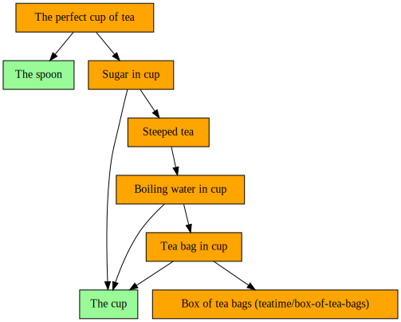

# iotaa

**It's One Thing After Another**

A simple workflow engine with semantics inspired by [Luigi](https://github.com/spotify/luigi) and tasks expressed as decorated Python functions (or methods), `iotaa` is pure Python, relies on no third-party packages, and is contained in a single module.

## Workflows

Workflows are composed of tasks, each of which comprises some combination of:

- Assets: Observable state. These are often external entities like files (or more abstract things like file line counts, REST API responses, times of day, etc.), but can also be in-memory data.
- Actions: Imperative logic to create or otherwise "ready" assets.
- Requirements: Dependency relationships defining the order in which tasks must be executed, and allowing a task to use assets from tasks it requires in readying its own assets.

## Assets

An asset (an instance of class `iotaa.Asset`) has two attributes:

1. `ref`: A value, of any type, identifying the observable state this asset represents (e.g. a filesystem path, a URI, a timestamp, a floating-point number).
2. `ready`: A 0-arity (no-argument) function that returns a `bool` indicating whether the asset is ready to use. Note that this should be a reference to a callable function, not a function _call_.

Create assets by calling `iotaa.asset()`.

## Tasks

A task is a decorated Python function that yields to `iotaa` its name and, depending on its type (see below), assets and/or required tasks. Tasks are identified by their names, so two tasks yielding the same name are considered identical and `iotaa` will discard one of them. Following its `yield` statements, a task that readies an asset provides action logic to do so, which is only executed if the assets of any required tasks are ready, and which may make use of those assets in its work.

`iotaa` provides three decorators to define tasks, described below. For each, assets and requirements may be single items, or a `list` of items, or a `dict` mapping `str` keys to items. Assets are specified as `iotaa.asset(ref=<object>, ready=<callable})` calls, and requiremens are specified as calls to task functions, e.g. `t(<args>)` for a task `t`.

For all task types, arbitrary Python statements may appear before and interspersed between the `yield` statements, but should generally not be permitted to affect external state. A common pattern is to assign a requirement's result to a variable, then `yield` that reesult via the variable, then access assets via `refs()`:

``` python
@task
def random_number_file(path: Path):
    yield "Random number file: %s" % path # Yield the task's name
    yield asset(path, path.is_file)       # Yield the task's asset
    rn = random_number()                  # Call a required task and save its result
    yield rn                              # Yield the requirement's result
    path.write_text(refs(rn))             # Action code to ready this task's asset
```

### `@task`

The essential task type, a `@task` function provides three `yield` statements yielding, in order:

1. Its name.
2. The asset(s) it readies.
3. Any requirements.

A task may have no requirements, in which case `None` can be specified. For example, a task to create a file with known content might not rely on any other tasks. (It could perhaps rely on another task to ready the parent directory, but could also create that directory itself.)

Action code following the final `yield` will be executed with the expectation that it will ready the task's asset(s). It is only executed if any required tasks' assets are all ready. Action code may access the values from required tasks' assets via `iotaa.refs()` (see example code below).

### `@tasks`

A collections of other tasks. A `@tasks` task is ready when all of its required tasks are ready. It provides two `yield` statements yielding, in order:

1. Its name.
2. The collection of requirements.

A `@tasks` function could yield a scalar requirement (or even `None`) but these probably make no sense in practice.

No action code should follow the final `yield`, as it will never be executed.

### `@external`

An `@external` task describes assets required by downstream tasks that are outside the workflow's power to ready. It provides two `yield` statements yielding, in order:

1. Its name.
2. The asset(s) that are required but cannot be readied by the workflow.

No action code should follow the final `yield`, as it will never be executed.

## Use

### Installation

Installation via a `conda` package at [anaconda.org](https://anaconda.org/conda-forge/iotaa):

- Into an existing, activated conda environment: `conda install -c conda-forge iotaa`
- Into a new environment called `iotaa`: `conda create -n iotaa -c conda-forge iotaa`

Installation via a `pip` package at [pypi.org](https://pypi.org/project/iotaa/):

- Into an existing, activated `venv` environment: `pip install iotaa`

Installation via local source, from the `src/` directory of an `iotaa` git clone:

- Into an existing, activated `venv` environment: `pip install .`
- Into an arbitrary directory (e.g. directory to be added to `PYTHONPATH`, or path to a `venv`): `pip install --prefix /some/path .`

Integration into another package:

- Copy the `src/iotaa/__init__.py` module as `iotaa.py` to another project. No `iotaa` CLI program will be available in this case, but `iotaa.main()` can be used to create one.

### CLI Use

```
$ iotaa --help
usage: iotaa [-d] [-g] [-h] [-s] [-t N] [-v] [--version] module [function] [args ...]

positional arguments:
  module
    application module name or path
  function
    task name
  args
    task arguments

optional arguments:
  -d, --dry-run
    run in dry-run mode
  -g, --graph
    emit Graphviz dot to stdout
  -h, --help
    show help and exit
  -s, --show
    show available tasks
  -t N, --threads N
    use N threads
  -v, --verbose
    enable verbose logging
  --version
    Show version info and exit
```

Specifying positional arguments `m f hello 42` calls task function `f` in module `m` with arguments `hello: str` and `42: int`. The positional arguments are parsed with the `json` library into Python values. To support intra-run idempotency (i.e. multiple tasks may depend on the same task, but the latter will only be evaluated/executed once), JSON values parsed to Python `dict` objects will be converted to a hashable (and therefore cacheable) `dict` subtype, and `list` objects will be converted to `tuple`s. Both should be treated as read-only in `iotaa` application code.

It is assumed that `m` is importable by Python by customary means. As a convenience, if `m` is a valid absolute or relative path (perhaps specified as `m.py` or `/path/to/m.py`), its parent directory is automatically added to `sys.path` so that it can be loaded.

Given a task graph comprising any number of nodes defined in module `m`, an arbitrary subgraph may be executed by specifying the desired root function `f`: Only `f` and its children will be processed, resulting in partial execution of the potentially larger workflow graph.

The `function` argument is optional (and ignored if supplied) if the `-s` / `--show` option, which shows the names of available task functions in `module`, is specified.

### Programmatic Use

After installation, `import iotaa` or `from iotaa import ...` to access public members. See the demo application below for example use.

### Dry-Run Mode

Use the CLI `--dry-mode` switch (or pass the `dry_run=True` argument when programmatically executing a task function) to run `iotaa` in a mode where no post-`yield` statements in `@task` bodies are executed. When applications are written such that no state-affecting statements precede the final `yield` statement, dry-run mode will report the current condition of the workflow, identifying not-ready requirements that are blocking workflow progress.

## Helpers

A number of public helper functions are available in the `iotaa` module:

| Function         | Description |
| ---------------- | ----------- |
| `asset()`        | Instantiates an asset to return from a task function. |
| `assets()`       | Given the value returned by a task-function call, returns any assets yielded by the task. |
| `graph()`        | Given the value returned by a task-function call, returns a Graphviz string representation of the task graph. |
| `logcfg()`       | Configures Python's root logger to support `logging.info()` et al. calls, which `iotaa` itself makes. It is called by the `iotaa` CLI, but is available for standalone applications with simple logging needs to call programmatically. |
| `ready()`        | Given the value returned by a task-function call, returns the ready status of the task. |
| `refs()`         | Given the value returned by a task-function call, returns `ref` values of the assets in the same shape (e.g. `dict`, `list`) as returned by the task. |
| `requirements()` | Given the value returned by a task-function call, returns any other such values yielded by that value as its requirements. |
| `tasknames()`    | Accepts an object (e.g. a module) and returns a list of names of  `iotaa` task members. This function is called when the `-s` / `--show` argument is provided to the CLI, which then prints each task name followed by, when available, the first line of its docstring.

Additionally, the `iotaa.log` attribute provides a reference to the logger in use by `iotaa`. By default this will be the Python root logger, configured per `iotaa` preferences; or a logger supplied via the `log=` keyword argument to a task-function call (see below).

## Development

In the base environment of a conda installation ([Miniforge](https://github.com/conda-forge/miniforge) recommended), install the [condev](https://github.com/maddenp/condev) [package](https://anaconda.org/maddenp/condev), then run `make devshell` in the root of an `iotaa` git clone. See the [condev docs](https://github.com/maddenp/condev/blob/main/README.md) for details but, in short: In the development shell created by `make devshell`, edit and test code live (either by starting a `python` REPL, or by invoking the `iotaa` CLI program), run the auto-formatter with `make format`, and run the code-quality tests with `make test`. Type `exit` to exit the development shell. (The underlying `DEV-iotaa` conda environment created by `make devshell` will persist until manually removed, so future `make devshell` invocations should be much faster than the first one, which must create the environment.)

## Important Notes

- Tasks yielding the same name are deemed identical by `iotaa`, which will add just one to the task graph for execution, discarding the rest. Be sure that distinct tasks `yield` distinct names, and sssume that `iotaa` may replace any task with another yielding the same name.
- The following keyword arguments to task functions are reserved: They are consumed by `iotaa`, not passed on to task functions, and should not appear in task function's argument lists.
    - `dry_run`: Instructs `iotaa` not to run the imperative logic in a `@task` function. Defaults to `False`. This argument is passed automatically by the `iotaa` CLI when the `--dry-run` switch is used. For dry-run mode to work correctly, ensure that any statements affecting external state execute only after the final `yield` statement in a task function's body.
    - `log`: Provides a custom Python `Logger` object for `iotaa` to use. Defaults to the Python root logger. Its use may require suppression of a linter warning at the call site. Task functions may access the in-use `iotaa` logger via the `iotaa.log` object.
    - `threads`: Specifies the number of concurrent threads to use. Defaults to 0.
- Since non-`yield` statements preceding the final `yield` statement may be executed at any time, and potentially multiple times, be sure that such statements are idempotent and do not produce side effects, unless such side effects are required.
- Workflows may be invoked repeatedly, potentially making further progress with each invocation, depending on readiness of external requirements. Since task functions' assets are checked for readiness before their requirements are checked or their post-`yield` statements are executed, completed work is never repeated (i.e. tasks are idempotent) -- unless the asset becomes not-ready via external means. For example, one might notice that an asset is incorrect, remove it, fix the workflow code, then re-run the workflow: `iotaa` would perform whatever work is necessary to re-ready the asset, but nothing more.

## Demo

Consider the source code of the [demo application](src/iotaa/demo.py), which simulates making a cup of tea (according to [the official recipe](https://www.google.com/search?q=masters+of+reality+t.u.s.a.+lyrics)).

The first `@tasks` method defines the end result: A cup of tea, steeped, with sugar -- and a spoon for stirring:

``` python
@tasks
def a_cup_of_tea(basedir):
    """
    The cup of steeped tea with sugar, and a spoon.
    """
    yield "The perfect cup of tea"
    yield [steeped_tea_with_sugar(basedir), spoon(basedir)]
```

As described above, a `@tasks` function is just a collection of other tasks, and must `yield` its name and the tasks it collects: In this case, the steeped tea with sugar, and the spoon. Since this function is a `@tasks` connection, no executable statements follow the final `yield.`

The `cup()` and `spoon()` `@task` functions are straightforward:

``` python
@task
def cup(basedir):
    """
    The cup for the tea.
    """
    path = Path(basedir) / "cup"
    taskname = "The cup"
    yield taskname
    yield asset(path, path.exists)
    yield None
    log.info("%s: Getting cup", taskname)
    path.mkdir(parents=True)
```

``` python
@task
def spoon(basedir):
    """
    The spoon to stir the tea.
    """
    path = Path(basedir) / "spoon"
    taskname = "The spoon"
    yield taskname
    yield asset(path, path.exists)
    yield None
    log.info("%s: Getting spoon", taskname)
    path.parent.mkdir(parents=True, exist_ok=True)
    path.touch()
```

They `yield` their names, then the asset each is responsible for readying, then the tasks they require (`None` in this case, since they have no requirements). Following the final `yield`, they ready their assets: `cup()` creates the `cup` directory that will contain the tea ingredients, and `spoon()` ensures that the base directory exists, then creates the `spoon` file in it. Note that the `cup` and `spoon` assets are filesystem entries (a directory and a file, respectively) in the same parent directory, and their task functions are written so that it does not matter which task executes first and creates that parent directory.

In task function `cup()`, note that, while `pathlib`'s `Path.mkdir()` would normally raise an exception if the specified directory already exists (unless the `exist_ok=True` argument is supplied, as it is in task function `spoon()`), the workflow need not explicitly guard against this because `iotaa` checks for the readiness of assets before executing code that would ready them. That is, `iotaa` will not execute the `path.mkdir()` statement if it determines that the asset represented by that directory is already ready (i.e. exists). This check is provided by the `path.exists` function supplied as the second argument to `asset()` in `cup()`.

The `steeped_tea_with_sugar()` `@task` function is next:

``` python
@task
def steeped_tea_with_sugar(basedir):
    """
    Add sugar to the steeped tea.

    Requires tea to have steeped.
    """
    yield from ingredient(basedir, "sugar", "Sugar", steeped_tea)
```

Two new ideas are demonstrated here. First, a task function can call arbitrary logic to help it carry out its duties. In this case, it calls an `ingredient()` helper function defined thus:

``` python
def ingredient(basedir, fn, name, req=None):
    """
    Add an ingredient to the cup.
    """
    taskname = f"{name} in cup"
    yield taskname
    the_cup = cup(basedir)
    path = refs(the_cup) / fn
    yield {fn: asset(path, path.exists)}
    yield [the_cup] + ([req(basedir)] if req else [])
    log.info("%s: Adding %s to cup", taskname, fn)
    path.touch()
```

This helper is also called by other task functions in the workflow, and simulates adding an ingredient (tea, water, sugar) to the tea cup, yielding values that the caller can re-`yield` to `iotaa`.

Second, `steeped_tea_with_sugar()` yields (indirectly, by passing it to `ingredient()`) a requirement: Sugar is added as a last step after the tea is steeped, so `steeped_tea_with_sugar()` requires `steeped_tea()`. Note that it passes the function _name_ rather than a call (i.e. `steeped_tea` instead of `steeped_tea(basedir)`) so that it can be called at the right time by `ingredient()`.

Next up, the `steeped_tea()` function, which is more complex:

``` python
@task
def steeped_tea(basedir):
    """
    Give tea time to steep.
    """
    taskname = "Steeped tea"
    yield taskname
    water = refs(steeping_tea(basedir))["water"]
    steep_time = lambda x: asset("elapsed time", lambda: x)
    t = 10  # seconds
    if water.exists():
        water_poured_time = dt.datetime.fromtimestamp(water.stat().st_mtime)
        ready_time = water_poured_time + dt.timedelta(seconds=t)
        now = dt.datetime.now()
        ready = now >= ready_time
        remaining = int((ready_time - now).total_seconds())
        yield steep_time(ready)
    else:
        ready = False
        remaining = t
        yield steep_time(False)
    yield steeping_tea(basedir)
    if not ready:
        log.warning("%s: Tea needs to steep for %ss", taskname, remaining)
```

Here, the asset being `yield`ed is more abstract: It represents a certain amount of time having passed since the boiling water was poured over the tea. (The observant reader will note that 10 seconds is insufficient, but handy for a demo. Try 3 minutes for black tea IRL.) If the water was poured long enough ago, `steeped_tea` is ready; if not, it should become ready during some future execution of the workflow. Note that the executable statements following the final `yield` only logs information: There's nothing this task can do to ready its asset (time passed): It can only wait.

Note the statement

``` python
water = refs(steeping_tea(basedir))["water"]
```

The path to the `water` file is located by calling `refs()` on the return value of `steeping_tea()` and taking the item with key `water` (because `ingredient()` yields its assets as `{fn: asset(path, path.exists)}`, where `fn` is the filename, e.g. `sugar`, `tea-bag`, `water`.) This is a useful way to delegate ownership of knowledge about an asset to the tasks responsible for that asset.

The `steeping_tea()` function is again a straightforward `@task`, leveraging the `ingredient()` helper:

``` python
@task
def steeping_tea(basedir):
    """
    Pour boiling water over the tea.

    Requires tea bag in cup.
    """
    yield from ingredient(basedir, "water", "Boiling water", tea_bag)
```

The `tea_bag()` function should be self-explanatory at this point. It requires `the_cup`, and extracts that task's reference (a path to a directory) to construct its own path:

``` python
@task
def tea_bag(basedir):
    """
    Place tea bag in the cup.

    Requires box of tea bags.
    """
    the_cup = cup(basedir)
    path = refs(the_cup) / "tea-bag"
    taskname = "Tea bag in cup"
    yield taskname
    yield asset(path, path.exists)
    yield [the_cup, box_of_tea_bags(basedir)]
    log.info("%s: Adding tea bag to cup", taskname)
    path.touch()
```

Finally, we have this workflow's only `@external` task, `box_of_tea_bags()`. The idea here is that this is something that simply must exist (think: someone must have simply bought the box of tea bags at the store), and no action by the workflow can create it. Unlike other task types, the `@external` yields, after its name, only the _assets_ it represents. It yields no task requirements, and has no executable statements to ready the asset:

``` python
@external
def box_of_tea_bags(basedir):
    """
    A box of tea bags.
    """
    path = Path(basedir) / "box-of-tea-bags"
    yield f"Box of tea bags ({path})"
    yield asset(path, path.exists)
```

Let's run this workflow with the `iotaa` command-line tool, requesting that the workflow start with the `a_cup_of_tea` task:

```
$ iotaa iotaa.demo a_cup_of_tea ./teatime
[2024-10-22T00:32:22] INFO    The cup: Executing
[2024-10-22T00:32:22] INFO    The cup: Getting cup
[2024-10-22T00:32:22] INFO    The cup: Ready
[2024-10-22T00:32:22] WARNING Box of tea bags (teatime/box-of-tea-bags): Not ready [external asset]
[2024-10-22T00:32:22] INFO    The spoon: Executing
[2024-10-22T00:32:22] INFO    The spoon: Getting spoon
[2024-10-22T00:32:22] INFO    The spoon: Ready
[2024-10-22T00:32:22] WARNING Tea bag in cup: Not ready
[2024-10-22T00:32:22] WARNING Tea bag in cup: Requires:
[2024-10-22T00:32:22] WARNING Tea bag in cup: ✔ The cup
[2024-10-22T00:32:22] WARNING Tea bag in cup: ✖ Box of tea bags (teatime/box-of-tea-bags)
[2024-10-22T00:32:22] WARNING Boiling water in cup: Not ready
[2024-10-22T00:32:22] WARNING Boiling water in cup: Requires:
[2024-10-22T00:32:22] WARNING Boiling water in cup: ✔ The cup
[2024-10-22T00:32:22] WARNING Boiling water in cup: ✖ Tea bag in cup
[2024-10-22T00:32:22] WARNING Steeped tea: Not ready
[2024-10-22T00:32:22] WARNING Steeped tea: Requires:
[2024-10-22T00:32:22] WARNING Steeped tea: ✖ Boiling water in cup
[2024-10-22T00:32:22] WARNING Sugar in cup: Not ready
[2024-10-22T00:32:22] WARNING Sugar in cup: Requires:
[2024-10-22T00:32:22] WARNING Sugar in cup: ✔ The cup
[2024-10-22T00:32:22] WARNING Sugar in cup: ✖ Steeped tea
[2024-10-22T00:32:22] WARNING The perfect cup of tea: Not ready
[2024-10-22T00:32:22] WARNING The perfect cup of tea: Requires:
[2024-10-22T00:32:22] WARNING The perfect cup of tea: ✖ Sugar in cup
[2024-10-22T00:32:22] WARNING The perfect cup of tea: ✔ The spoon
```

There's lots to see during the first invocation. Most of the tasks cannot run due to not-ready requirements and so are themselves left in a not-ready state. Only the `cup()` and `spoon()` tasks, which have no requirements, execute and end in the `Ready` state. We will see in subsequent workflow invocations that these tasks are not executed again, as their assets will be found to be ready.

The on-disk workflow state is now:

```
$ tree teatime/
teatime
├── cup
└── spoon

2 directories, 1 file
```

Note the blocker:

```
[2024-10-22T00:32:22] WARNING Tea bag in cup: ✖ Box of tea bags (teatime/box-of-tea-bags)
```

The external asset (file) `teatime/box-of-tea-bags` cannot be created by the workflow, as it is declared `@external`. Let's create it manually:

```
$ touch teatime/box-of-tea-bags
$ tree teatime/
teatime
├── box-of-tea-bags
├── cup
└── spoon

2 directories, 2 files
```

Now let's iterate the workflow:

```
$ iotaa iotaa.demo a_cup_of_tea ./teatime
[2024-10-22T00:32:56] INFO    The cup: Ready
[2024-10-22T00:32:56] INFO    Box of tea bags (teatime/box-of-tea-bags): Ready
[2024-10-22T00:32:56] INFO    The spoon: Ready
[2024-10-22T00:32:56] INFO    Tea bag in cup: Executing
[2024-10-22T00:32:56] INFO    Tea bag in cup: Adding tea bag to cup
[2024-10-22T00:32:56] INFO    Tea bag in cup: Ready
[2024-10-22T00:32:56] INFO    Boiling water in cup: Executing
[2024-10-22T00:32:56] INFO    Boiling water in cup: Adding water to cup
[2024-10-22T00:32:56] INFO    Boiling water in cup: Ready
[2024-10-22T00:32:56] INFO    Steeped tea: Executing
[2024-10-22T00:32:56] WARNING Steeped tea: Tea needs to steep for 10s
[2024-10-22T00:32:56] WARNING Steeped tea: Not ready
[2024-10-22T00:32:56] WARNING Steeped tea: Requires:
[2024-10-22T00:32:56] WARNING Steeped tea: ✔ Boiling water in cup
[2024-10-22T00:32:56] WARNING Sugar in cup: Not ready
[2024-10-22T00:32:56] WARNING Sugar in cup: Requires:
[2024-10-22T00:32:56] WARNING Sugar in cup: ✔ The cup
[2024-10-22T00:32:56] WARNING Sugar in cup: ✖ Steeped tea
[2024-10-22T00:32:56] WARNING The perfect cup of tea: Not ready
[2024-10-22T00:32:56] WARNING The perfect cup of tea: Requires:
[2024-10-22T00:32:56] WARNING The perfect cup of tea: ✖ Sugar in cup
[2024-10-22T00:32:56] WARNING The perfect cup of tea: ✔ The spoon
```

On-disk workflow state now:

```
$ tree teatime/
teatime
├── box-of-tea-bags
├── cup
│   ├── tea-bag
│   └── water
└── spoon

2 directories, 4 files
```

Since the box of tea bags became available, the workflow was able to add a tea bag to the cup and pour boiling water over it. Note the message `Tea needs to steep for 10s`. If we iterate the workflow again after a few seconds, we can see the steep time decreasing:

```
[2024-10-22T00:32:56] WARNING Steeped tea: Tea needs to steep for 10s
```

If we wait a bit longer and iterate:

```
$ iotaa iotaa.demo a_cup_of_tea ./teatime
[2024-10-22T00:34:12] INFO    The cup: Ready
[2024-10-22T00:34:12] INFO    Steeped tea: Ready
[2024-10-22T00:34:12] INFO    The spoon: Ready
[2024-10-22T00:34:12] INFO    Sugar in cup: Executing
[2024-10-22T00:34:12] INFO    Sugar in cup: Adding sugar to cup
[2024-10-22T00:34:12] INFO    Sugar in cup: Ready
[2024-10-22T00:34:12] INFO    The perfect cup of tea: Ready
```

Now that the tea has steeped long enough, the sugar has been added:

```
$ tree teatime/
teatime
├── box-of-tea-bags
├── cup
│   ├── sugar
│   ├── tea-bag
│   └── water
└── spoon

2 directories, 5 files
```

One more iteration and we see that the workflow has reached its final state and takes no more action:

```
$ iotaa iotaa.demo a_cup_of_tea ./teatime
[2024-10-22T00:34:52] INFO    The perfect cup of tea: Ready
```

Since `a_cup_of_tea()` is a `@tasks` _collection_, its state is contingent on that of its required tasks, so its readiness check will always involve checking requirements, unlike a non-collection `@task`, which can just check its assets.

One useful feature of this kind of workflow is its ability to recover from damage to its external state. Here, we remove the sugar from the tea (don't try this at home):

```
$ rm -v teatime/cup/sugar
removed 'teatime/cup/sugar'
$ tree teatime/
teatime/
├── box-of-tea-bags
├── cup
│   ├── tea-bag
│   └── water
└── spoon

2 directories, 4 files
```

Note how the workflow detects the change to the readiness of its assets and recovers:

```
$ iotaa iotaa.demo a_cup_of_tea ./teatime
[2024-10-22T00:37:27] INFO    The cup: Ready
[2024-10-22T00:37:27] INFO    Steeped tea: Ready
[2024-10-22T00:37:27] INFO    The spoon: Ready
[2024-10-22T00:37:27] INFO    Sugar in cup: Executing
[2024-10-22T00:37:27] INFO    Sugar in cup: Adding sugar to cup
[2024-10-22T00:37:27] INFO    Sugar in cup: Ready
[2024-10-22T00:37:27] INFO    The perfect cup of tea: Ready
```

```
$ tree teatime/
teatime/
├── box-of-tea-bags
├── cup
│   ├── sugar
│   ├── tea-bag
│   └── water
└── spoon

2 directories, 5 files
```

Another useful feature is the ability to enter the workflow's task graph at an arbitrary point to obtain only a subset of the assets. For example, if we'd like a cup of tea _without_ sugar, we can start with the `steeped_tea` task rather than the higher-level `a_cup_of_tea` task.

First, let's empty the cup:

```
$ rm -v teatime/cup/*
removed 'teatime/cup/sugar'
removed 'teatime/cup/tea-bag'
removed 'teatime/cup/water'
(DEV-iotaa) ~/git/iotaa $ tree teatime/
teatime/
├── box-of-tea-bags
├── cup
└── spoon

2 directories, 2 files
```

Now request tea without sugar:

```
$ iotaa iotaa.demo steeped_tea ./teatime
[2024-10-22T00:39:50] INFO    The cup: Ready
[2024-10-22T00:39:50] INFO    Box of tea bags (teatime/box-of-tea-bags): Ready
[2024-10-22T00:39:50] INFO    Tea bag in cup: Executing
[2024-10-22T00:39:50] INFO    Tea bag in cup: Adding tea bag to cup
[2024-10-22T00:39:50] INFO    Tea bag in cup: Ready
[2024-10-22T00:39:50] INFO    Boiling water in cup: Executing
[2024-10-22T00:39:50] INFO    Boiling water in cup: Adding water to cup
[2024-10-22T00:39:50] INFO    Boiling water in cup: Ready
[2024-10-22T00:39:50] INFO    Steeped tea: Executing
[2024-10-22T00:39:50] WARNING Steeped tea: Tea needs to steep for 10s
[2024-10-22T00:39:50] WARNING Steeped tea: Not ready
[2024-10-22T00:39:50] WARNING Steeped tea: Requires:
[2024-10-22T00:39:50] WARNING Steeped tea: ✔ Boiling water in cup
```

After waiting for the tea to steep:

```
$ iotaa iotaa.demo steeped_tea ./teatime
[2024-10-22T00:40:17] INFO    Steeped tea: Ready
```

On-disk state:

```
$ tree teatime/
teatime/
├── box-of-tea-bags
├── cup
│   ├── tea-bag
│   └── water
└── spoon

2 directories, 4 files
```

The `-v` / `--verbose` switch can be used for additional logging. Here, for example, is the verbose log output of a fresh run:

```
$ rm -rf teatime/
$ iotaa --verbose iotaa.demo a_cup_of_tea ./teatime
[2024-10-22T01:03:18] DEBUG   ──────────
[2024-10-22T01:03:18] DEBUG   Task Graph
[2024-10-22T01:03:18] DEBUG   ──────────
[2024-10-22T01:03:18] DEBUG   The perfect cup of tea
[2024-10-22T01:03:18] DEBUG     Sugar in cup
[2024-10-22T01:03:18] DEBUG       The cup
[2024-10-22T01:03:18] DEBUG       Steeped tea
[2024-10-22T01:03:18] DEBUG         Boiling water in cup
[2024-10-22T01:03:18] DEBUG           The cup
[2024-10-22T01:03:18] DEBUG           Tea bag in cup
[2024-10-22T01:03:18] DEBUG             The cup
[2024-10-22T01:03:18] DEBUG             Box of tea bags (teatime/box-of-tea-bags)
[2024-10-22T01:03:18] DEBUG     The spoon
[2024-10-22T01:03:18] DEBUG   ─────────
[2024-10-22T01:03:18] DEBUG   Execution
[2024-10-22T01:03:18] DEBUG   ─────────
[2024-10-22T01:03:18] INFO    The cup: Executing
[2024-10-22T01:03:18] INFO    The cup: Getting cup
[2024-10-22T01:03:18] INFO    The cup: Ready
[2024-10-22T01:03:18] WARNING Box of tea bags (teatime/box-of-tea-bags): Not ready [external asset]
[2024-10-22T01:03:18] INFO    The spoon: Executing
[2024-10-22T01:03:18] INFO    The spoon: Getting spoon
[2024-10-22T01:03:18] INFO    The spoon: Ready
[2024-10-22T01:03:18] WARNING Tea bag in cup: Not ready
[2024-10-22T01:03:18] WARNING Tea bag in cup: Requires:
[2024-10-22T01:03:18] WARNING Tea bag in cup: ✔ The cup
[2024-10-22T01:03:18] WARNING Tea bag in cup: ✖ Box of tea bags (teatime/box-of-tea-bags)
[2024-10-22T01:03:18] WARNING Boiling water in cup: Not ready
[2024-10-22T01:03:18] WARNING Boiling water in cup: Requires:
[2024-10-22T01:03:18] WARNING Boiling water in cup: ✔ The cup
[2024-10-22T01:03:18] WARNING Boiling water in cup: ✖ Tea bag in cup
[2024-10-22T01:03:18] WARNING Steeped tea: Not ready
[2024-10-22T01:03:18] WARNING Steeped tea: Requires:
[2024-10-22T01:03:18] WARNING Steeped tea: ✖ Boiling water in cup
[2024-10-22T01:03:18] WARNING Sugar in cup: Not ready
[2024-10-22T01:03:18] WARNING Sugar in cup: Requires:
[2024-10-22T01:03:18] WARNING Sugar in cup: ✔ The cup
[2024-10-22T01:03:18] WARNING Sugar in cup: ✖ Steeped tea
[2024-10-22T01:03:18] WARNING The perfect cup of tea: Not ready
[2024-10-22T01:03:18] WARNING The perfect cup of tea: Requires:
[2024-10-22T01:03:18] WARNING The perfect cup of tea: ✖ Sugar in cup
[2024-10-22T01:03:18] WARNING The perfect cup of tea: ✔ The spoon
```

## Graphing

The `-g` / `--graph` switch can be used to emit to `stdout` a description of the current state of the workflow graph in [Graphviz](https://graphviz.org/) [DOT](https://graphviz.org/doc/info/lang.html) format. Here, for example, the preceding demo workflow is executed in dry-run mode with graph output requested, and the graph document rendered as an SVG image by `dot` and displayed by the Linux utility `display`:

```
$ iotaa --dry-run --graph iotaa.demo a_cup_of_tea ./teatime | display <(dot -T svg)
[2024-10-22T00:41:53] INFO    The cup: SKIPPING (DRY RUN)
[2024-10-22T00:41:53] WARNING The cup: Not ready
[2024-10-22T00:41:53] WARNING Box of tea bags (teatime/box-of-tea-bags): Not ready [external asset]
[2024-10-22T00:41:53] INFO    The spoon: SKIPPING (DRY RUN)
[2024-10-22T00:41:53] WARNING The spoon: Not ready
[2024-10-22T00:41:53] WARNING Tea bag in cup: Not ready
[2024-10-22T00:41:53] WARNING Tea bag in cup: Requires:
[2024-10-22T00:41:53] WARNING Tea bag in cup: ✖ The cup
[2024-10-22T00:41:53] WARNING Tea bag in cup: ✖ Box of tea bags (teatime/box-of-tea-bags)
[2024-10-22T00:41:53] WARNING Boiling water in cup: Not ready
[2024-10-22T00:41:53] WARNING Boiling water in cup: Requires:
[2024-10-22T00:41:53] WARNING Boiling water in cup: ✖ The cup
[2024-10-22T00:41:53] WARNING Boiling water in cup: ✖ Tea bag in cup
[2024-10-22T00:41:53] WARNING Steeped tea: Not ready
[2024-10-22T00:41:53] WARNING Steeped tea: Requires:
[2024-10-22T00:41:53] WARNING Steeped tea: ✖ Boiling water in cup
[2024-10-22T00:41:53] WARNING Sugar in cup: Not ready
[2024-10-22T00:41:53] WARNING Sugar in cup: Requires:
[2024-10-22T00:41:53] WARNING Sugar in cup: ✖ The cup
[2024-10-22T00:41:53] WARNING Sugar in cup: ✖ Steeped tea
[2024-10-22T00:41:53] WARNING The perfect cup of tea: Not ready
[2024-10-22T00:41:53] WARNING The perfect cup of tea: Requires:
[2024-10-22T00:41:53] WARNING The perfect cup of tea: ✖ Sugar in cup
[2024-10-22T00:41:53] WARNING The perfect cup of tea: ✖ The spoon
```

The displayed image:


Orange nodes indicate tasks with not-ready assets.

Removing `--dry-run` and following the first phase of the demo tutorial in the previous section, the following succession of graph images are shown:

- After the first invocation, with cup and spoon added but blocked by missing (external) box of tea bags:



- After the second invocation, with box of tea bags available, with hot water poured:


- After the third invocation, when the tea has steeped and sugar has been added, showing final workflow state:


## Cookbook

### In-Memory Asset

External state (e.g. files on disk) is probably the most common type of `iotaa` asset. The following mechanism may be useful for representing an in-memory asset:

`location1.py`

``` python
import logging

import requests

from iotaa import asset, logcfg, ready, refs, task

logcfg()


@task
def json(lat: float, lon: float) -> str:
    val = []
    yield "JSON for lat %s lon %s" % (lat, lon)
    yield asset(val, lambda: bool(val))
    yield None
    url = "https://api.weather.gov/points/%s,%s" % (lat, lon)
    val.append(requests.get(url).json())


@task
def main(lat: float, lon: float):
    ran = False
    taskname = "Main"
    yield taskname
    yield asset(None, lambda: ran)
    req = json(lat, lon)
    yield req
    if ready(req):
        city, state = [
            refs(req)[0]["properties"]["relativeLocation"]["properties"][x]
            for x in ("city", "state")
        ]
        logging.info("%s: Location: %s, %s", taskname, city, state)
    ran = True
```

```
$ iotaa location1.py main 40.1672 -105.1091
[2025-01-20T20:26:17] INFO    JSON for lat 40.1672 lon -105.1091: Executing
[2025-01-20T20:26:18] INFO    JSON for lat 40.1672 lon -105.1091: Ready
[2025-01-20T20:26:18] INFO    Main: Executing
[2025-01-20T20:26:18] INFO    Main: Location: Longmont, CO
[2025-01-20T20:26:18] INFO    Main: Ready
```

Since `val` is initially empty, the second (`ready`) argument to `asset()` is initially `False`, so the task must execute its imperative section (the code following the final `yield`). Then `val` becomes non-empty, so `ready(result)` in the caller returns `True` and `val` can be extracted by calling `refs()` on the result.

In this simple example, there's no obvious benefit to `json()` being a `@task` instead of a normal function. But, in a case where multiple tasks have a common requirement, depulication of tasks and the ability to retrieve in-memory values from tasks can be a benefit. For example:

`location2.py`

``` python
import logging

import requests

from iotaa import asset, logcfg, ready, refs, task

logcfg()

get = lambda req, x: refs(req)[0]["properties"]["relativeLocation"]["properties"][x]


@task
def json(lat: float, lon: float) -> str:
    val = []
    yield "JSON for lat %s lon %s" % (lat, lon)
    yield asset(val, lambda: bool(val))
    yield None
    url = "https://api.weather.gov/points/%s,%s" % (lat, lon)
    val.append(requests.get(url).json())


@task
def city(lat: float, lon: float) -> str:
    val = []
    yield "City for lat %s lon %s" % (lat, lon)
    yield asset(val, lambda: bool(val))
    req = json(lat, lon)
    yield req
    val.append(get(req, "city"))


@task
def state(lat: float, lon: float) -> str:
    val = []
    yield "State for lat %s lon %s" % (lat, lon)
    yield asset(val, lambda: bool(val))
    req = json(lat, lon)
    yield req
    val.append(get(req, "state"))


@task
def main(lat: float, lon: float):
    ran = False
    taskname = "Main"
    yield taskname
    yield asset(None, lambda: ran)
    reqs = {"city": city(lat, lon), "state": state(lat, lon)}
    yield reqs
    if all(ready(req) for req in reqs.values()):
        logging.info(
            "%s: Location: %s, %s",
            taskname,
            refs(reqs["city"])[0],
            refs(reqs["state"])[0],
        )
    ran = True
```

```
$ iotaa location2.py main 40.1672 -105.1091
[2025-01-20T20:30:24] INFO    JSON for lat 40.1672 lon -105.1091: Executing
[2025-01-20T20:30:24] INFO    JSON for lat 40.1672 lon -105.1091: Ready
[2025-01-20T20:30:24] INFO    City for lat 40.1672 lon -105.1091: Executing
[2025-01-20T20:30:24] INFO    City for lat 40.1672 lon -105.1091: Ready
[2025-01-20T20:30:24] INFO    State for lat 40.1672 lon -105.1091: Executing
[2025-01-20T20:30:24] INFO    State for lat 40.1672 lon -105.1091: Ready
[2025-01-20T20:30:24] INFO    Main: Executing
[2025-01-20T20:30:24] INFO    Main: Location: Longmont, CO
[2025-01-20T20:30:24] INFO    Main: Ready
```

Here, both `city()` and `state()` `yield` `json(lat, lon)` as a requirement. Since the calls are identical, and because `json()` yields the same taskname for both calls, `iotaa` deduplicates the calls and executes a single `json` task, its assets made available to both callers.

### CPU-Bound Tasks

Thread-based concurrency as implemented by `iotaa` helps overall execution time for IO-based tasks, but is less helpful (or even detrimental) for CPU-bound tasks. For example, here is a workflow that computes two Fibonacci numbers whose indices are `n1`, and `n2`:

`fibonacci1.py`

``` python
import logging

from iotaa import asset, logcfg, ready, refs, task

logcfg()


def fib(n: int) -> int:
    return n if n < 2 else fib(n - 2) + fib(n - 1)


@task
def fibonacci(n: int):
    val: list[int] = []
    yield "Fibonacci %s" % n
    yield asset(val, lambda: bool(val))
    yield None
    val.append(fib(n))


@task
def main(n1: int, n2: int):
    ran = False
    taskname = "Main"
    yield taskname
    yield asset(None, lambda: ran)
    reqs = [fibonacci(n1), fibonacci(n2)]
    yield reqs
    if all(ready(req) for req in reqs):
        logging.info("%s %s", *[refs(req)[0] for req in reqs])
    ran = True
```

Here's a synchronous run:

```
$ time iotaa fibonacci1.py main 36 37
[2025-01-20T22:30:43] INFO    Fibonacci 36: Executing
[2025-01-20T22:30:46] INFO    Fibonacci 36: Ready
[2025-01-20T22:30:46] INFO    Fibonacci 37: Executing
[2025-01-20T22:30:49] INFO    Fibonacci 37: Ready
[2025-01-20T22:30:49] INFO    Main: Executing
[2025-01-20T22:30:49] INFO    14930352 24157817
[2025-01-20T22:30:49] INFO    Main: Ready

real	0m6.156s
user	0m6.103s
sys	0m0.054s
```

Unsurprisingly, using threads does not decrease the execution time:

```
$ time iotaa -t 2 fibonacci1.py main 36 37
[2025-01-20T22:31:11] INFO    Fibonacci 37: Executing
[2025-01-20T22:31:11] INFO    Fibonacci 36: Executing
[2025-01-20T22:31:15] INFO    Fibonacci 36: Ready
[2025-01-20T22:31:17] INFO    Fibonacci 37: Ready
[2025-01-20T22:31:17] INFO    Main: Executing
[2025-01-20T22:31:17] INFO    14930352 24157817
[2025-01-20T22:31:17] INFO    Main: Ready

real	0m6.202s
user	0m6.127s
sys	0m0.083s
```

For CPU-bound tasks, use `multiprocessing` from the Python standard library to offload work on to separate CPU cores. Here, two two Fibonacci numbers are calculated in separate `Process`es, their value communicated back to the main process via a `Value` object:

`fibonacci2.py`

``` python
import logging
from multiprocessing import Process, Value
from multiprocessing.sharedctypes import Synchronized
from typing import Optional

from iotaa import asset, logcfg, ready, refs, task

logcfg()


def fib(n: int, v: Optional[Synchronized] = None) -> int:
    result = n if n < 2 else fib(n - 2) + fib(n - 1)
    if v:
        v.value = result
    return result


@task
def fibonacci(n: int):
    val = Value("i", -1)
    yield "Fibonacci %s" % n
    yield asset(val, lambda: val.value >= 0)
    yield None
    p = Process(target=fib, args=(n, val))
    p.start()
    p.join()


@task
def main(n1: int, n2: int):
    ran = False
    taskname = "Main"
    yield taskname
    yield asset(None, lambda: ran)
    reqs = [fibonacci(n1), fibonacci(n2)]
    yield reqs
    if all(ready(req) for req in reqs):
        logging.info("%s %s", *[refs(req).value for req in reqs])
    ran = True
```

This decreases the execution time:

```
$ time iotaa -t 2 fibonacci2.py main 36 37
[2025-01-20T22:32:05] INFO    Fibonacci 36: Executing
[2025-01-20T22:32:05] INFO    Fibonacci 37: Executing
[2025-01-20T22:32:08] INFO    Fibonacci 36: Ready
[2025-01-20T22:32:10] INFO    Fibonacci 37: Ready
[2025-01-20T22:32:10] INFO    Main: Executing
[2025-01-20T22:32:10] INFO    14930352 24157817
[2025-01-20T22:32:10] INFO    Main: Ready

real	0m5.062s
user	0m8.132s
sys	0m0.044s
```

The execution time is dominated by the time required to calculate the larger Fibonacci number, as can be seen by setting `n1` to `0`:

```
$ time iotaa fibonacci2.py main 0 37
[2025-01-20T22:35:31] INFO    Fibonacci 0: Executing
[2025-01-20T22:35:31] INFO    Fibonacci 0: Ready
[2025-01-20T22:35:31] INFO    Fibonacci 37: Executing
[2025-01-20T22:35:36] INFO    Fibonacci 37: Ready
[2025-01-20T22:35:36] INFO    Main: Executing
[2025-01-20T22:35:36] INFO    0 24157817
[2025-01-20T22:35:36] INFO    Main: Ready

real	0m5.022s
user	0m4.985s
sys	0m0.038s
```
