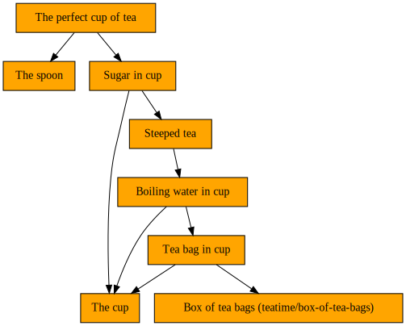

# iotaa

**It's One Thing After Another**

A simple workflow engine with semantics inspired by [Luigi](https://github.com/spotify/luigi) and tasks expressed as decorated Python functions (or methods), `iotaa` is pure Python, relies on no third-party packages, and is contained in a single module.

## Workflows

Workflows are composed of tasks, each of which is some combination of:

- Assets: Observable state, an asset is often an external entity like a file, but may also be a more abstract entity like a file line count, REST API response, time of day, or any kind of in-memory data.
- Actions: Imperative logic to create or otherwise "ready" assets.
- Requirements: Dependency relationships that define the order in which tasks must be executed, they also allow a task to use assets from tasks it requires when readying its own assets.

A workflow can be thought of as a graph where tasks are nodes and the dependency relationships between them are directed edges between them.

## Assets

An asset (an instance of class `iotaa.Asset`) has two attributes:

1. `ref`: A value, of any type, identifying the observable state this asset represents.
2. `ready`: A 0-arity (no-argument) function that returns a `bool` indicating whether the asset is ready to use. Note that this should be a reference to a callable function, not a function _call_.

Create an asset by calling `iotaa.Asset(ref=<ref>, ready=<callable>)`.

See the _In-Memory Asset_ topic in the _Cookbook_ section for a strategy for handling in-memory assets.

## Tasks

A task is a decorated Python function that yields to `iotaa` its name and, depending on its type (see below), assets and/or required tasks. A task is identified by its name, so multiple tasks yielding the same name are considered equivalent, and `iotaa` will select one as a representative for execution.

Following its `yield` statements, a task that readies an asset provides action code to do so, which is only executed if the assets of any required tasks are ready, and which may make use of those assets in its work.

`iotaa` provides three decorators to define tasks, described below. For each, assets and requirements may be a single (scalar) item, a `list` of items, or a `dict` mapping `str` keys to items. Assets are specified as `iotaa.Asset(ref=<object>, ready=<callable})` calls, and requiremens are specified as calls to task functions, e.g. `t(<args>)` for a required task `t`.

For all task types, arbitrary Python statements may appear before and interspersed between the `yield` statements, but should generally not be permitted to affect external state. A useful pattern is to assign a requirement to a variable, yield that variable, then access its assets via its `.ref` property (or by passing it as the argument to the `iotaa.ref()` helper function). For example:

``` python
@task
def random_number_file(path: Path):
    yield "Random number file: %s" % path # Yield task name
    yield Asset(path, path.is_file)       # Yield task asset
    rn = random_number()                  # Call and save required task
    yield rn                              # Yield required task
    path.write_text(rn.ref)               # Ready THIS task's asset, using the requirement's asset.
```

### `@task`

The essential task type, a `@task` function yields, in order:

1. Its name.
2. The asset(s) it readies.
3. Any requirements.

A task may have no requirements, in which case `None` can be specified. For example, a task to create a file with static content might not rely on any other tasks. (It could perhaps rely on another task to ready the parent directory, but could also create that directory itself before writing the file.)

Action code following the final `yield` will be executed with the expectation that it will ready the task's asset(s). It is only executed if all required tasks' assets are all ready. Action code may access the values from required tasks' assets via their `.ref` properties (or by passing them to the `iotaa.ref()` helper function -- see the demo application below).

### `@collection`

A collection of other tasks, a `@collection` task is ready when all of its required tasks are ready. It yields, in order:

1. Its name.
2. The collection of required tasks: A `list` of task-function calls, or a `dict` mapping `str` keys to task-function-call values. A `@collection` task could yield a scalar requirement (or even `None`) but this probably makes no sense in practice.

No action code should follow the final `yield`: It will never be executed.

### `@external`

An `@external` task describes assets required by downstream tasks that are outside the workflow's power to ready. It yields, in order:

1. Its name.
2. The asset(s) that are required but cannot be readied by the workflow.

No action code should follow the final `yield`: It will never be executed.

## Use

### Installation

Installation via a `conda` package at [anaconda.org](https://anaconda.org/conda-forge/iotaa):

- Into an existing, activated conda environment: `conda install -c conda-forge iotaa`
- Into a new environment called `iotaa`: `conda create -n iotaa -c conda-forge iotaa`

Installation via a `pip` package at [pypi.org](https://pypi.org/project/iotaa/):

- Into an existing, activated `venv` environment: `pip install iotaa`

Installation via local source, from the `src/` directory of an `iotaa` git clone:

- Into an existing, activated `venv` environment: `pip install .`
- Into an arbitrary directory (e.g. directory to be added to `PYTHONPATH`, or path to a `venv`): `pip install --prefix /some/path .`

Integration into another package:

- Copy the `src/iotaa/iotaa.py` module to another project. No `iotaa` CLI program will be available in this case, but `iotaa.main()` can be used to create one.

### CLI Use

```
$ iotaa --help
usage: iotaa [-d] [-g] [-h] [-s] [-t N] [-v] [--version] module [function] [args ...]

positional arguments:
  module
    application module name or path
  function
    task name
  args
    task arguments

optional arguments:
  -d, --dry-run
    run in dry-run mode
  -g, --graph
    emit Graphviz dot to stdout
  -h, --help
    show help and exit
  -s, --show
    show available tasks
  -t N, --threads N
    use N threads
  -v, --verbose
    enable verbose logging
  --version
    Show version info and exit
```

Specifying positional arguments `module function hello 42` calls task function `function` in module `module` with arguments `hello: str` and `42: int`. Positional arguments past `module` and `function` are parsed with the `json` library into Python values.

It is assumed that `module` is importable by Python by customary means. As a convenience, if `module` is a valid absolute or relative path (perhaps specified as `module.py` or `/path/to/module.py`), its parent directory will automatically be added to `sys.path` so that it can be imported.

Given a task graph comprising any number of nodes, any arbitrary subgraph may be executed by specifying the appropriate root function `function`: Only `function` and its requirement(s) (and their requirements, etc.) will be executed, resulting in partial processing of the potentially larger graph.

The `function` argument is optional, and ignored if supplied, if the `-s` / `--show` option to show the names of available task functions in `module` is specified.

### Programmatic Use

After installation, `import iotaa` or `from iotaa import <name>` to access public members. See the demo application below for example use.

### Dry-Run Mode

Use the `--dry-mode` CLI switch, or supply the `dry_run=True` argument when calling a task-graph root function, to run `iotaa` in a mode where no post-`yield` action statements in `@task` bodies are executed. When applications are written such that no state-affecting statements precede the final `yield` statement, dry-run mode will report the current state of the workflow without affecting state, potentially identifying not-ready requirements that are blocking workflow progress.

### Threading

Use the `--threads` CLI switch, or supply the `threads=` argument when calling a task-graph root function, to process the task graph with the specified number of threads. Threads can speed up workflows by executing IO-bound tasks concurrently. (See the _Cookbook_ section, below, for information on combining threads and processes to speed up CPU-bound tasks.)

When using threads, note that log messages relating to different tasks may be interleaved. Those logged by `iotaa` itself should be prefixed with each task's name, so it should be clear which messages belong to which task. When creating custom log messages by via `iotaa.log`, consider prefixing them with the taskname, too, to allow them to be logically grouped together when reading.

## Helpers

A number of public helper functions are available in the `iotaa` module:

| Function         | Description |
| ---------------- | ----------- |
| `asset()`        | Given the `Node` value returned by a task-function call, return the asset(s) yielded by the task. Equivalent to accessing the `.asset` property of the `Node`. |
| `graph()`        | Given the `Node` value returned by a task-function call, return a Graphviz string representation of the task graph. Equivalent to accessing the `.graph` property of the `Node`. |
| `logcfg()`       | Configure Python's root logger for use by `iotaa`. Called by the CLI, but available for standalone applications with simple logging needs to call programmatically. |
| `ready()`        | Given the `Node` value returned by a task-function call, return the ready (`bool`) status of the task. Equivalent to accessing the `.ready` property of the `Node`. |
| `ref()`          | Given the `Node` value returned by a task-function call, a single asset, a `list` of assets, or a `dict` whose values are assets, return the `ref` values of the asset(s) in the corresponding shape (e.g. `dict`, `list`). Accessing the `.ref` property returns the `ref` values for the assets of that `Node`. |
| `req()`          | Given the `Node` value returned by a task-function call, return the represented task's requirement(s), themselves `Node` values. Equivalent to accessing the `.req` property of the `Node`. |
| `tasknames()`    | Given an object (e.g. a module), return a list of names of  `iotaa` task members. Called by the CLI when `-s` / `--show` is specified. Prints each task name followed by, when available, the first line of its docstring. |

Some linters may not recognize the existence of `Node` properties `.asset`, `.graph`, `.ready`, `.ref`, and `.req`. In such cases, calling the corresponding helper functions instead may silence complaints.

Additionally, `iotaa.log` provides a reference to the logger in use by `iotaa`. By default this will be the Python root logger, configured by `iotaa`. But, if a custom logger was supplied via the `log=` keyword argument to a task-graph root function, `iotaa.log` will reference that logger. Thus, application code can safely call `iotaa.log.info()`, `iotaa.log.debug()`, etc.

## Development

In the base environment of a conda installation ([Miniforge](https://github.com/conda-forge/miniforge) recommended), install the [condev](https://github.com/maddenp/condev) [package](https://anaconda.org/maddenp/condev), then run `make devshell` in the root of an `iotaa` git clone. See the [condev docs](https://github.com/maddenp/condev/blob/main/README.md) for details but, in short: In the development shell created by `make devshell`, edit and test code live (either by starting a `python` REPL, or by invoking the `iotaa` CLI program), run the auto-formatter with `make format`, and run the code-quality tests with `make test`. Type `exit` to exit the development shell. (The underlying `DEV-iotaa` conda environment created by `make devshell` will persist until manually removed, so future `make devshell` invocations should be much faster than the first, which must create the environment.)

## Important Notes and Tips

- Tasks yielding the same task name are deemed equivalent by `iotaa`, which will add a single representative to the task graph for execution and patch the rest with references to the representative's assets . Be sure that distinct tasks yield distinct names. If it appears that `iotaa` is not executing all expected tasks, too-general task names may be the cause.
- For efficient task-graph execution, if `iotaa` finds that a task's assets are ready, it will ignore all that task's requirements, adding no child nodes for them to the task graph. Furthermore, when it _does_ process a task's requirement(s), it will discard any that are themselves ready. For this reason, yielding assets as soon as possible, before doing any work constructing requirements, may speed up workflow execution.
- Tasks with all their assets ready will not be re-executed, nor their requirements revisited. So, in order to force re-execution (for example, after a configuration change that would produce different assets) it is necessary to externally make them _not ready_, e.g. by deleting on-disk files for filesystem-based assets.
- The following keyword arguments to task functions are reserved. They need only be provided when calling the root function of a task graph from outside `iotaa`, not when calling a task function as a requirement inside a decorated `@task`, `@collection`, or `@external` task. They are consumed by `iotaa`, not passed on to task functions, and should not appear in task functions' argument lists. Since they do not appear in argument lists, linter complaints may need to be suppressed at some call sites.
    - `dry_run`: Instructs `iotaa` not to run the action code in `@task` functions. Defaults to `False`. Passed automatically by the `iotaa` CLI when the `--dry-run` switch is specified. For dry-run mode to work correctly, ensure that any statements affecting state appear only after the final `yield` statement in `@task` functions, and that `@collection` and `@external` tasks perform no state-affecting actions.
    - `log`: Provides a custom Python `Logger` object for `iotaa` to use. Defaults to the Python root logger as configured by `iotaa`. Task functions may access the in-use `iotaa` logger via the `iotaa.log` object.
    - `threads`: Specifies the number of concurrent threads to use. Defaults to 1. When interrupted for example by CTRL-C, `iotaa` waits for outstanding tasks to complete before exiting; terminating `iotaa` forcefully may leave the workflow in an inconsistent state requiring manual recovery.
- Workflows may be invoked repeatedly, potentially making further progress with each invocation, depending on readiness of requirements. Since task functions' assets are checked for readiness before their requirements are checked or their post-`yield` statements are executed, completed work is never repeated. That is, correctly designed tasks are idempotent, unless their assets become not-ready by external means. For example, one might notice that an asset is incorrect, remove it, fix the workflow code, then re-run the workflow: `iotaa` would perform whatever work is necessary to re-ready the asset, but nothing more.

## Demo

Consider the source code of the [demo application](src/iotaa/demo.py), which simulates making a cup of tea (according to [the official recipe](https://www.google.com/search?q=masters+of+reality+t.u.s.a.+lyrics)).

The first `@collection` task defines the end result: A cup of tea, steeped, with sugar, and a spoon for stirring:

``` python
@collection
def a_cup_of_tea(basedir):
    """
    The cup of steeped tea with sugar, and a spoon.
    """
    yield "The perfect cup of tea"
    yield [steeped_tea_with_sugar(basedir), spoon(basedir)]
```

As described above, a `@collection` task is just a collection of other tasks, and must yield its name and the tasks it collects: In this case, the steeped tea with sugar, and the spoon. Since this function is a `@collection` task, no executable statements follow the final `yield`.

The `cup()` and `spoon()` `@task` functions are straightforward:

``` python
@task
def cup(basedir):
    """
    The cup for the tea.
    """
    path = Path(basedir) / "cup"
    taskname = "The cup"
    yield taskname
    yield Asset(path, path.exists)
    yield None
    log.info("%s: Getting cup", taskname)
    path.mkdir(parents=True)
```

``` python
@task
def spoon(basedir):
    """
    The spoon to stir the tea.
    """
    path = Path(basedir) / "spoon"
    taskname = "The spoon"
    yield taskname
    yield Asset(path, path.exists)
    yield None
    log.info("%s: Getting spoon", taskname)
    path.parent.mkdir(parents=True, exist_ok=True)
    path.touch()
```

They yield their names, then the asset each is responsible for readying, then the tasks they require (`None` in this case, since they rely on nothing). Following the final `yield`, they ready their assets: `cup()` creates the `cup` directory that will contain the tea ingredients; `spoon()` ensures that the base directory exists, then creates the `spoon` file in it. The `cup` and `spoon` assets are filesystem entries (a directory and a file, respectively) in the same parent directory, and their task functions are written so that it does not matter which task executes first and creates that parent directory.

Note that in task function `cup()`, while `pathlib`'s `Path.mkdir()` would normally raise an exception if the specified directory already exists (unless the `exist_ok=True` argument is supplied, as it is in task function `spoon()`), the workflow need not explicitly guard against this because `iotaa` checks for the readiness of assets before executing code that would ready them. That is, `iotaa` will not execute the `path.mkdir()` statement if it determines that the asset represented by that directory is already ready (i.e. exists). This check is provided by the `path.exists` function supplied as the second argument to `Asset()` in `cup()`.

The `steeped_tea_with_sugar()` `@task` function is next:

``` python
@task
def steeped_tea_with_sugar(basedir):
    """
    Add sugar to the steeped tea.

    Requires tea to have steeped.
    """
    yield from ingredient(basedir, "sugar", "Sugar", steeped_tea)
```

Two new ideas are demonstrated here. First, a task function can call arbitrary logic to help it carry out its duties. In this case, it calls the `ingredient()` helper function:

``` python
def ingredient(basedir, fn, name, req=None):
    """
    Add an ingredient to the cup.
    """
    taskname = f"{name} in cup"
    yield taskname
    the_cup = cup(basedir)
    path = the_cup.ref / fn
    yield {fn: Asset(path, path.exists)}
    yield [the_cup] + ([req(basedir)] if req else [])
    log.info("%s: Adding %s to cup", taskname, fn)
    path.touch()
```

This helper is also called by other task functions in the workflow, and simulates adding an ingredient (tea, water, sugar) to the tea cup, yielding values that the caller can re-yield to `iotaa`.

Second, `steeped_tea_with_sugar()` yields (indirectly, by passing it to `ingredient()`) a requirement: Sugar is added as a last step after the tea is steeped, so `steeped_tea_with_sugar()` requires `steeped_tea()`. Note that it passes the function _name_ rather than a call (i.e. `steeped_tea` instead of `steeped_tea(basedir)`) so that it can be called at the right time by `ingredient()`.

Next up, the `steeped_tea()` function, which is more complex:

``` python
@task
def steeped_tea(basedir):
    """
    Give tea time to steep.
    """
    taskname = "Steeped tea"
    yield taskname
    water = steeping_tea(basedir).ref["water"]
    steep_time = lambda x: Asset("elapsed time", lambda: x)
    t = 10  # seconds
    if water.exists():
        water_poured_time = dt.datetime.fromtimestamp(water.stat().st_mtime)
        ready_time = water_poured_time + dt.timedelta(seconds=t)
        now = dt.datetime.now()
        ready = now >= ready_time
        remaining = int((ready_time - now).total_seconds())
        yield steep_time(ready)
    else:
        ready = False
        remaining = t
        yield steep_time(False)
    yield steeping_tea(basedir)
    if not ready:
        log.warning("%s: Tea needs to steep for %ss", taskname, remaining)
```

Here, the asset being yielded is abstract: It represents a certain amount of time having passed since the boiling water was poured over the tea. (The observant reader will note that 10 seconds is insufficient, but handy for a demo. Try 3 minutes for black tea IRL.) If the water was poured long enough ago, `steeped_tea` is ready; if not, it should become ready during some future execution of the workflow. Note that the executable statements following the final `yield` only logs information: There's nothing this task can do to ready its asset (time passed): It can only wait.

Note that the path to the `water` file is located by accessing the `.ref` property on the return value of `steeping_tea()` and taking the item with key `water` (because `ingredient()` yields its assets as `{fn: Asset(path, path.exists)}`, where `fn` is the filename, e.g. `sugar`, `tea-bag`, `water`.) This is a useful way to delegate ownership of knowledge about an asset to the tasks responsible for that asset.

The `steeping_tea()` function is again a straightforward `@task`, leveraging the `ingredient()` helper:

``` python
@task
def steeping_tea(basedir):
    """
    Pour boiling water over the tea.

    Requires tea bag in cup.
    """
    yield from ingredient(basedir, "water", "Boiling water", tea_bag)
```

The `tea_bag()` function should be self-explanatory at this point. It requires `the_cup`, and extracts that task's reference (a path to a directory) to construct its own path:

``` python
@task
def tea_bag(basedir):
    """
    Place tea bag in the cup.

    Requires box of tea bags.
    """
    the_cup = cup(basedir)
    path = the_cup.ref / "tea-bag"
    taskname = "Tea bag in cup"
    yield taskname
    yield Asset(path, path.exists)
    yield [the_cup, box_of_tea_bags(basedir)]
    log.info("%s: Adding tea bag to cup", taskname)
    path.touch()
```

Finally, we have this workflow's only `@external` task, `box_of_tea_bags()`. The idea here is that this is something that just must exist (think: someone must have simply bought the box of tea bags at the store), and no action by the workflow can create it. Unlike other task types, an `@external` task yields, after its name, only the _assets_ it represents. It yields no requirements, and provides no action code to ready the asset:

``` python
@external
def box_of_tea_bags(basedir):
    """
    A box of tea bags.
    """
    path = Path(basedir) / "box-of-tea-bags"
    yield f"Box of tea bags ({path})"
    yield Asset(path, path.exists)
```

Let's run this workflow with the `iotaa` CLI, requesting that the workflow start with the `a_cup_of_tea` task:

```
$ iotaa iotaa.demo a_cup_of_tea teatime
[2025-11-17T01:28:40] INFO    The cup: Executing
[2025-11-17T01:28:40] INFO    The cup: Getting cup
[2025-11-17T01:28:40] INFO    The cup: Ready
[2025-11-17T01:28:40] WARNING Box of tea bags (teatime/box-of-tea-bags): Not ready [external asset]
[2025-11-17T01:28:40] INFO    The spoon: Executing
[2025-11-17T01:28:40] INFO    The spoon: Getting spoon
[2025-11-17T01:28:40] INFO    The spoon: Ready
[2025-11-17T01:28:40] WARNING Tea bag in cup: Not ready
[2025-11-17T01:28:40] WARNING Tea bag in cup: Requires:
[2025-11-17T01:28:40] WARNING Tea bag in cup: ✔ The cup
[2025-11-17T01:28:40] WARNING Tea bag in cup: ✖ Box of tea bags (teatime/box-of-tea-bags)
[2025-11-17T01:28:40] WARNING Boiling water in cup: Not ready
[2025-11-17T01:28:40] WARNING Boiling water in cup: Requires:
[2025-11-17T01:28:40] WARNING Boiling water in cup: ✔ The cup
[2025-11-17T01:28:40] WARNING Boiling water in cup: ✖ Tea bag in cup
[2025-11-17T01:28:40] WARNING Steeped tea: Not ready
[2025-11-17T01:28:40] WARNING Steeped tea: Requires:
[2025-11-17T01:28:40] WARNING Steeped tea: ✖ Boiling water in cup
[2025-11-17T01:28:40] WARNING Sugar in cup: Not ready
[2025-11-17T01:28:40] WARNING Sugar in cup: Requires:
[2025-11-17T01:28:40] WARNING Sugar in cup: ✔ The cup
[2025-11-17T01:28:40] WARNING Sugar in cup: ✖ Steeped tea
[2025-11-17T01:28:40] WARNING The perfect cup of tea: Not ready
[2025-11-17T01:28:40] WARNING The perfect cup of tea: Requires:
[2025-11-17T01:28:40] WARNING The perfect cup of tea: ✖ Sugar in cup
[2025-11-17T01:28:40] WARNING The perfect cup of tea: ✔ The spoon
```

There's lots to see during the first invocation. Most of the tasks cannot run due to not-ready requirements and so are themselves left in a not-ready state. Only the `cup()` and `spoon()` tasks, which have no requirements, execute and end in the `Ready` state. We will see in subsequent workflow invocations that these tasks are not executed again, as their assets will be found to be ready.

The on-disk workflow state is now:

```
$ tree teatime
teatime
├── cup
└── spoon

1 directory, 1 file
```

Note the blocker marked `WARNING`: The external asset (file) `teatime/box-of-tea-bags` is not ready and cannot be created by the workflow, as it is declared `@external`. But we can create it manually:

```
$ touch teatime/box-of-tea-bags
```

```
$ tree teatime
teatime
├── box-of-tea-bags
├── cup
└── spoon

1 directory, 2 files
```

Iterate the workflow:

```
$ iotaa iotaa.demo a_cup_of_tea teatime
[2025-11-17T01:28:40] INFO    Tea bag in cup: Executing
[2025-11-17T01:28:40] INFO    Tea bag in cup: Adding tea bag to cup
[2025-11-17T01:28:40] INFO    Tea bag in cup: Ready
[2025-11-17T01:28:40] INFO    Boiling water in cup: Executing
[2025-11-17T01:28:40] INFO    Boiling water in cup: Adding water to cup
[2025-11-17T01:28:40] INFO    Boiling water in cup: Ready
[2025-11-17T01:28:40] INFO    Steeped tea: Executing
[2025-11-17T01:28:40] WARNING Steeped tea: Tea needs to steep for 10s
[2025-11-17T01:28:40] WARNING Steeped tea: Not ready
[2025-11-17T01:28:40] WARNING Steeped tea: Requires:
[2025-11-17T01:28:40] WARNING Steeped tea: ✔ Boiling water in cup
[2025-11-17T01:28:40] WARNING Sugar in cup: Not ready
[2025-11-17T01:28:40] WARNING Sugar in cup: Requires:
[2025-11-17T01:28:40] WARNING Sugar in cup: ✖ Steeped tea
[2025-11-17T01:28:40] WARNING The perfect cup of tea: Not ready
[2025-11-17T01:28:40] WARNING The perfect cup of tea: Requires:
[2025-11-17T01:28:40] WARNING The perfect cup of tea: ✖ Sugar in cup
```

On-disk workflow state now:

```
$ tree teatime
teatime
├── box-of-tea-bags
├── cup
│   ├── tea-bag
│   └── water
└── spoon

1 directory, 4 files
```

Since the box of tea bags became available, the workflow was able to add a tea bag to the cup and pour boiling water over it. Note the message `Tea needs to steep for 10s`. If we iterate the workflow again after a few seconds, we can see the steep time decreasing:

```
$ iotaa iotaa.demo a_cup_of_tea teatime
...
[2025-11-17T01:28:45] WARNING Steeped tea: Tea needs to steep for 4s
...
```

Wait a bit and iterate again:

```
$ iotaa iotaa.demo a_cup_of_tea teatime
[2025-11-17T01:28:50] INFO    Sugar in cup: Executing
[2025-11-17T01:28:50] INFO    Sugar in cup: Adding sugar to cup
[2025-11-17T01:28:50] INFO    Sugar in cup: Ready
[2025-11-17T01:28:50] INFO    The perfect cup of tea: Ready
```

Now that the tea has steeped long enough, the sugar has been added:

```
$ tree teatime
teatime
├── box-of-tea-bags
├── cup
│   ├── sugar
│   ├── tea-bag
│   └── water
└── spoon

1 directory, 5 files
```

One more iteration and we see that the workflow has reached its final state and takes no more action:

```
$ iotaa iotaa.demo a_cup_of_tea teatime
[2025-11-17T01:28:50] INFO    The perfect cup of tea: Ready
```

One useful feature of this kind of workflow is its ability to recover from damage to its external state. Here, we remove the sugar from the tea (don't try this at home):

```
$ rm -v teatime/cup/sugar
removed 'teatime/cup/sugar'
```

```
$ tree teatime
teatime
├── box-of-tea-bags
├── cup
│   ├── tea-bag
│   └── water
└── spoon

1 directory, 4 files
```

Note how the workflow detects the change to the readiness of its assets and recovers:

```
$ iotaa iotaa.demo a_cup_of_tea teatime
[2025-11-17T01:28:51] INFO    Sugar in cup: Executing
[2025-11-17T01:28:51] INFO    Sugar in cup: Adding sugar to cup
[2025-11-17T01:28:51] INFO    Sugar in cup: Ready
[2025-11-17T01:28:51] INFO    The perfect cup of tea: Ready
```

```
$ tree teatime
teatime
├── box-of-tea-bags
├── cup
│   ├── sugar
│   ├── tea-bag
│   └── water
└── spoon

1 directory, 5 files
```

Another useful feature is the ability to enter the workflow's task graph at an arbitrary point and process a subgraph to obtain only a subset of the assets. For example, if we'd like a cup of tea _without_ sugar, we can start with the `steeped_tea` task rather than the higher-level `a_cup_of_tea` task.

First, let's empty the cup:

```
$ rm -v teatime/cup/*
removed 'teatime/cup/sugar'
removed 'teatime/cup/tea-bag'
removed 'teatime/cup/water'
```

```
$ tree teatime
teatime
├── box-of-tea-bags
├── cup
└── spoon

1 directory, 2 files
```

Now request tea without sugar:

```
$ iotaa iotaa.demo steeped_tea teatime
[2025-11-17T01:28:51] INFO    Tea bag in cup: Executing
[2025-11-17T01:28:51] INFO    Tea bag in cup: Adding tea bag to cup
[2025-11-17T01:28:51] INFO    Tea bag in cup: Ready
[2025-11-17T01:28:51] INFO    Boiling water in cup: Executing
[2025-11-17T01:28:51] INFO    Boiling water in cup: Adding water to cup
[2025-11-17T01:28:51] INFO    Boiling water in cup: Ready
[2025-11-17T01:28:51] INFO    Steeped tea: Executing
[2025-11-17T01:28:51] WARNING Steeped tea: Tea needs to steep for 10s
[2025-11-17T01:28:51] WARNING Steeped tea: Not ready
[2025-11-17T01:28:51] WARNING Steeped tea: Requires:
[2025-11-17T01:28:51] WARNING Steeped tea: ✔ Boiling water in cup
```

After waiting for the tea to steep:

```
$ iotaa iotaa.demo steeped_tea teatime
[2025-11-17T01:29:01] INFO    Steeped tea: Ready
```

On-disk state:

```
$ tree teatime
teatime
├── box-of-tea-bags
├── cup
│   ├── tea-bag
│   └── water
└── spoon

1 directory, 4 files
```

The `-v` / `--verbose` switch can be used for additional logging. Here, for example, is the verbose log output of a fresh run:

```
$ rm -rf teatime
```

```
$ iotaa --verbose iotaa.demo a_cup_of_tea teatime
[2025-11-17T01:29:01] DEBUG   Deduplicating task-graph nodes
[2025-11-17T01:29:01] DEBUG   ──────────
[2025-11-17T01:29:01] DEBUG   Task Graph
[2025-11-17T01:29:01] DEBUG   ──────────
[2025-11-17T01:29:01] DEBUG   The perfect cup of tea
[2025-11-17T01:29:01] DEBUG     Sugar in cup
[2025-11-17T01:29:01] DEBUG       The cup
[2025-11-17T01:29:01] DEBUG       Steeped tea
[2025-11-17T01:29:01] DEBUG         Boiling water in cup
[2025-11-17T01:29:01] DEBUG           The cup
[2025-11-17T01:29:01] DEBUG           Tea bag in cup
[2025-11-17T01:29:01] DEBUG             The cup
[2025-11-17T01:29:01] DEBUG             Box of tea bags (teatime/box-of-tea-bags)
[2025-11-17T01:29:01] DEBUG     The spoon
[2025-11-17T01:29:01] DEBUG   ─────────
[2025-11-17T01:29:01] DEBUG   Execution
[2025-11-17T01:29:01] DEBUG   ─────────
[2025-11-17T01:29:01] INFO    The cup: Executing
[2025-11-17T01:29:01] INFO    The cup: Getting cup
[2025-11-17T01:29:01] INFO    The cup: Ready
[2025-11-17T01:29:01] DEBUG   The cup: Task completed
[2025-11-17T01:29:01] WARNING Box of tea bags (teatime/box-of-tea-bags): Not ready [external asset]
[2025-11-17T01:29:01] DEBUG   Box of tea bags (teatime/box-of-tea-bags): Task completed
[2025-11-17T01:29:01] INFO    The spoon: Executing
[2025-11-17T01:29:01] INFO    The spoon: Getting spoon
[2025-11-17T01:29:01] INFO    The spoon: Ready
[2025-11-17T01:29:01] DEBUG   The spoon: Task completed
[2025-11-17T01:29:01] WARNING Tea bag in cup: Not ready
[2025-11-17T01:29:01] WARNING Tea bag in cup: Requires:
[2025-11-17T01:29:01] WARNING Tea bag in cup: ✔ The cup
[2025-11-17T01:29:01] WARNING Tea bag in cup: ✖ Box of tea bags (teatime/box-of-tea-bags)
[2025-11-17T01:29:01] DEBUG   Tea bag in cup: Task completed
[2025-11-17T01:29:01] WARNING Boiling water in cup: Not ready
[2025-11-17T01:29:01] WARNING Boiling water in cup: Requires:
[2025-11-17T01:29:01] WARNING Boiling water in cup: ✔ The cup
[2025-11-17T01:29:01] WARNING Boiling water in cup: ✖ Tea bag in cup
[2025-11-17T01:29:01] DEBUG   Boiling water in cup: Task completed
[2025-11-17T01:29:01] WARNING Steeped tea: Not ready
[2025-11-17T01:29:01] WARNING Steeped tea: Requires:
[2025-11-17T01:29:01] WARNING Steeped tea: ✖ Boiling water in cup
[2025-11-17T01:29:01] DEBUG   Steeped tea: Task completed
[2025-11-17T01:29:01] WARNING Sugar in cup: Not ready
[2025-11-17T01:29:01] WARNING Sugar in cup: Requires:
[2025-11-17T01:29:01] WARNING Sugar in cup: ✔ The cup
[2025-11-17T01:29:01] WARNING Sugar in cup: ✖ Steeped tea
[2025-11-17T01:29:01] DEBUG   Sugar in cup: Task completed
[2025-11-17T01:29:01] WARNING The perfect cup of tea: Not ready
[2025-11-17T01:29:01] WARNING The perfect cup of tea: Requires:
[2025-11-17T01:29:01] WARNING The perfect cup of tea: ✖ Sugar in cup
[2025-11-17T01:29:01] WARNING The perfect cup of tea: ✔ The spoon
[2025-11-17T01:29:01] DEBUG   The perfect cup of tea: Task completed
```

## Graphing

The `-g` / `--graph` switch can be used to emit to `stdout` a description of the current state of the workflow task graph in [Graphviz](https://graphviz.org/) [DOT](https://graphviz.org/doc/info/lang.html) format. Here, for example, the preceding demo workflow is executed in dry-run mode with graph output requested, and the graph document rendered as an SVG image by `dot`:

```
$ iotaa --dry-run --graph iotaa.demo a_cup_of_tea teatime 2>/dev/null | dot -Tsvg >img/teatime-0.svg
```

The displayed image:



Orange nodes indicate not-ready tasks.

Removing `--dry-run` and following the first phase of the demo tutorial in the previous section, the following succession of workflow task graph images are shown:

- After the first invocation, with cup and spoon added but blocked by missing (external) box of tea bags:


- After the second invocation, with box of tea bags available and hot water poured, the workflow task graph omits completed work:


- After the third invocation, when the tea has steeped and sugar has been added, the workflow task graph looks like:


- And, finally, any subsequent invocations show the final workflow task graph state:


## Cookbook

### Atomic Writes

Since `iotaa` uses assets' `ready` predicates to guide execution and does not rely on e.g. a progress database, it is important that when assets claim to be ready, they really are. A notorious source of error in this regard is partially written files. Given, for example `Asset(ref=path, ready=path.is_file)`, if the task function creating `path` opens that file, starts writing to it, then is killed before writing is complete, a future invocation of the workflow will see the asset as ready and will not re-execute the task. Worse, a task depending on this one will assume that it can use the incomplete output.

To protect against this, consider writing to a temporary file and then renaming the file (an [atomic operation](https://rcrowley.org/2010/01/06/things-unix-can-do-atomically.html)) when the file is complete. A context manager similar to the following may be useful:

``` python
@contextmanager
def atomic(path: Path) -> Iterator[Path]:
    path.parent.mkdir(parents=True, exist_ok=True)
    tmp = Path(f"{path}.tmp")
    yield tmp
    tmp.rename(path)
```

Example usage:

``` python
with atomic(final_file) as temp_file:
    temp_file.write_bytes(data)
```

If `write_bytes(data)` is interrupted, `final_file` will not yet exist, and a future `iotaa` invocation will re-execute the task, hopefully creating it successfully.

### CPU-Bound Tasks

Thread-based concurrency as implemented by `iotaa` helps overall execution time for IO-based tasks, but is less helpful (or even detrimental) for CPU-bound tasks. For example, here is a workflow that computes two Fibonacci numbers whose indices are `n1` and `n2`:

`fibonacci1.py`

``` python
from iotaa import Asset, log, logcfg, task

logcfg()


def fib(n: int) -> int:
    return n if n < 2 else fib(n - 2) + fib(n - 1)


@task
def fibonacci(n: int):
    val: list[int] = []
    yield "Fibonacci %s" % n
    yield Asset(val, lambda: bool(val))
    yield None
    val.append(fib(n))


@task
def main(n1: int, n2: int):
    ran = False
    taskname = "Main"
    yield taskname
    yield Asset(None, lambda: ran)
    reqs = [fibonacci(n1), fibonacci(n2)]
    yield reqs
    if all(req.ready for req in reqs):
        log.info("%s %s", *[req.ref[0] for req in reqs])
    ran = True
```

Here's a synchronous run:

```
$ bash -c "time iotaa fibonacci1 main 36 37"
[2025-11-17T01:29:11] INFO    Fibonacci 36: Executing
[2025-11-17T01:29:14] INFO    Fibonacci 36: Ready
[2025-11-17T01:29:14] INFO    Fibonacci 37: Executing
[2025-11-17T01:29:18] INFO    Fibonacci 37: Ready
[2025-11-17T01:29:18] INFO    Main: Executing
[2025-11-17T01:29:18] INFO    14930352 24157817
[2025-11-17T01:29:18] INFO    Main: Ready

real	0m7.255s
user	0m7.247s
sys	0m0.008s
```

Unsurprisingly, using threads does not decrease the execution time much:

```
$ bash -c "time iotaa --threads 2 fibonacci1 main 36 37"
[2025-11-17T01:29:18] INFO    Fibonacci 36: Executing
[2025-11-17T01:29:18] INFO    Fibonacci 37: Executing
[2025-11-17T01:29:24] INFO    Fibonacci 36: Ready
[2025-11-17T01:29:25] INFO    Fibonacci 37: Ready
[2025-11-17T01:29:25] INFO    Main: Executing
[2025-11-17T01:29:25] INFO    14930352 24157817
[2025-11-17T01:29:25] INFO    Main: Ready

real	0m7.158s
user	0m7.140s
sys	0m0.028s
```

For CPU-bound tasks, use `multiprocessing` from the Python standard library to offload work on to separate CPU cores. Here, two two Fibonacci numbers are calculated in separate `Process`es, their value communicated back to the main process via a `Value` object:

`fibonacci2.py`

``` python
from __future__ import annotations

from multiprocessing import Process, Value
from typing import TYPE_CHECKING

from iotaa import Asset, log, logcfg, task

if TYPE_CHECKING:
    from multiprocessing.sharedctypes import Synchronized

logcfg()


def fib(n: int, v: Synchronized | None = None) -> int:
    result = n if n < 2 else fib(n - 2) + fib(n - 1)
    if v:
        v.value = result
    return result


@task
def fibonacci(n: int):
    val = Value("i", -1)
    yield "Fibonacci %s" % n
    yield Asset(val, lambda: val.value >= 0)
    yield None
    p = Process(target=fib, args=(n, val))
    p.start()
    p.join()


@task
def main(n1: int, n2: int):
    ran = False
    taskname = "Main"
    yield taskname
    yield Asset(None, lambda: ran)
    reqs = [fibonacci(n1), fibonacci(n2)]
    yield reqs
    if all(req.ready for req in reqs):
        log.info("%s %s", *[req.ref.value for req in reqs])
    ran = True
```

This decreases the execution time:

```
$ bash -c "time iotaa --threads 2 fibonacci2 main 36 37"
[2025-11-17T01:29:25] INFO    Fibonacci 36: Executing
[2025-11-17T01:29:25] INFO    Fibonacci 37: Executing
[2025-11-17T01:29:29] INFO    Fibonacci 36: Ready
[2025-11-17T01:29:31] INFO    Fibonacci 37: Ready
[2025-11-17T01:29:31] INFO    Main: Executing
[2025-11-17T01:29:31] INFO    14930352 24157817
[2025-11-17T01:29:31] INFO    Main: Ready

real	0m5.293s
user	0m8.549s
sys	0m0.019s
```

The execution time is dominated by the time required to calculate the larger Fibonacci number, as can be seen by setting `n1` to `0`:

```
$ bash -c "time iotaa --threads 2 fibonacci2 main 0 37"
[2025-11-17T01:29:31] INFO    Fibonacci 0: Executing
[2025-11-17T01:29:31] INFO    Fibonacci 37: Executing
[2025-11-17T01:29:31] INFO    Fibonacci 0: Ready
[2025-11-17T01:29:36] INFO    Fibonacci 37: Ready
[2025-11-17T01:29:36] INFO    Main: Executing
[2025-11-17T01:29:36] INFO    0 24157817
[2025-11-17T01:29:36] INFO    Main: Ready

real	0m5.150s
user	0m5.144s
sys	0m0.009s
```

### In-Memory Asset

External state (e.g. files on disk) may be the most common type of `iotaa` asset, but the following technique can be used to represent an in-memory asset (`val`):

`location1.py`

``` python
import requests

from iotaa import asset, log, logcfg, task

logcfg()


@task
def json(lat: float, lon: float):
    val: list[str] = []
    yield "JSON for lat %s lon %s" % (lat, lon)
    yield Asset(val, lambda: bool(val))
    yield None
    url = "https://api.weather.gov/points/%s,%s" % (lat, lon)
    val.append(requests.get(url, timeout=3).json())


@task
def main(lat: float, lon: float):
    ran = False
    taskname = "Main"
    yield taskname
    yield Asset(None, lambda: ran)
    req = json(lat, lon)
    yield req
    city, state = [
        req.ref[0]["properties"]["relativeLocation"]["properties"][x] for x in ("city", "state")
    ]
    log.info("%s: Location: %s, %s", taskname, city, state)
    ran = True
```

```
$ iotaa location1.py main 40.1672 -105.1091
[2025-04-01T16:36:20] INFO    JSON for lat 40.1672 lon -105.1091: Executing
[2025-04-01T16:36:21] INFO    JSON for lat 40.1672 lon -105.1091: Ready
[2025-04-01T16:36:21] INFO    Main: Executing
[2025-04-01T16:36:21] INFO    Main: Location: Longmont, CO
[2025-04-01T16:36:21] INFO    Main: Ready
```

Since `val` is initially empty in `json()`, the second argument to `Asset()`, its readiness function, initially returns `False` when called, so the task must execute its action code (the code following the final `yield`). Then `val` becomes non-empty, and thus truthy. When `iotaa` later checks the readiness of `json()` by calling its asset's readiness function, the now-truthy `val` tells `iotaa` that it is safe to proceed past `yield req` (where `req` refers to `json()`) and run the action code in `main()`, where `val` can then safely be extracted by `req.ref`.

Any mutable value could potentially fill the role of `val` using this mechanism. In this case, a `list` is mutated with `.append()`. A `dict` val could be mutated with `.update()`, a `set` with `.add()`, and `+=` could mutate a NumPy `ndarray`. The key is that the value returned by `Asset(val, lambda: bool(val))` is a closure that captures `val` -- at the moment of that call -- such that it survives beyond the scope of the `json()` function. A change to `val` via an assignment statement like `val = requests.get(url).json()` in the action code would not be visible outside the lexical scope of `json()`.

In this simple example, there's no obvious benefit to `json()` being a `@task` instead of a normal function. But, in a case where multiple tasks have a common requirement, depulication of tasks and the ability to retrieve in-memory values from tasks can be a benefit. For example:

`location2.py`

``` python
import requests

from iotaa import Asset, log, logcfg, ready, task

logcfg()

get = lambda req, x: req.ref[0]["properties"]["relativeLocation"]["properties"][x]


@task
def json(lat: float, lon: float):
    val: list[str] = []
    yield "JSON for lat %s lon %s" % (lat, lon)
    yield Asset(val, lambda: bool(val))
    yield None
    url = "https://api.weather.gov/points/%s,%s" % (lat, lon)
    val.append(requests.get(url, timeout=3).json())


@task
def city(lat: float, lon: float):
    val: list[str] = []
    yield "City for lat %s lon %s" % (lat, lon)
    yield Asset(val, lambda: bool(val))
    req = json(lat, lon)
    yield req
    val.append(get(req, "city"))


@task
def state(lat: float, lon: float):
    val: list[str] = []
    yield "State for lat %s lon %s" % (lat, lon)
    yield Asset(val, lambda: bool(val))
    req = json(lat, lon)
    yield req
    val.append(get(req, "state"))


@task
def main(lat: float, lon: float):
    ran = False
    taskname = "Main"
    yield taskname
    yield Asset(None, lambda: ran)
    reqs = {"city": city(lat, lon), "state": state(lat, lon)}
    yield reqs
    if all(ready(req) for req in reqs.values()):
        log.info(
            "%s: Location: %s, %s",
            taskname,
            reqs["city"].ref[0],
            reqs["state"].ref[0],
        )
    ran = True
```

```
$ iotaa location2.py main 40.1672 -105.1091
[2025-04-01T16:43:59] INFO    JSON for lat 40.1672 lon -105.1091: Executing
[2025-04-01T16:43:59] INFO    JSON for lat 40.1672 lon -105.1091: Ready
[2025-04-01T16:43:59] INFO    City for lat 40.1672 lon -105.1091: Executing
[2025-04-01T16:43:59] INFO    City for lat 40.1672 lon -105.1091: Ready
[2025-04-01T16:43:59] INFO    State for lat 40.1672 lon -105.1091: Executing
[2025-04-01T16:43:59] INFO    State for lat 40.1672 lon -105.1091: Ready
[2025-04-01T16:43:59] INFO    Main: Executing
[2025-04-01T16:43:59] INFO    Main: Location: Longmont, CO
[2025-04-01T16:43:59] INFO    Main: Ready
```

Here, both `city()` and `state()` yield `json(lat, lon)` as a requirement. Since the calls are identical, and because `json()` yields the same taskname for both calls, `iotaa` deduplicates the calls and executes a single `json` task, its assets made available to both callers. This avoids pointless duplicate network requests.

### Time Gate

An `@xternal` task can serve as a time gate, such that a dependent task cannot execute until a certain time has been reached. For example:

`timegate.py`

``` python
from datetime import datetime, timezone
from pathlib import Path

from iotaa import asset, external, task


@external
def wait(gotime: datetime):
    yield "Time %s" % gotime
    yield Asset(None, lambda: datetime.now(timezone.utc) >= gotime)


@task
def file(gotime: str):
    path = Path("file")
    yield "Touch %s" % path
    yield Asset(path, path.is_file)
    yield wait(datetime.fromisoformat(f"{gotime}+00:00"))
    path.touch()
```

A few seconds before the specified time:

```
$ date --utc
Mon Feb 17 06:02:54 AM UTC 2025
$ iotaa timegate.py file 2025-02-17T06:03:00
[2025-02-17T06:02:56] WARNING Time 2025-02-17 06:03:00+00:00: Not ready [external asset]
[2025-02-17T06:02:56] WARNING Touch file: Not ready
[2025-02-17T06:02:56] WARNING Touch file: Requires:
[2025-02-17T06:02:56] WARNING Touch file: ✖ Time 2025-02-17 06:03:00+00:00
```

A few seconds later:

```
$ date --utc
Mon Feb 17 06:03:01 AM UTC 2025
$ iotaa timegate.py file 2025-02-17T06:03:00
[2025-02-17T06:03:04] INFO    Time 2025-02-17 06:03:00+00:00: Ready
[2025-02-17T06:03:04] INFO    Touch file: Executing
[2025-02-17T06:03:04] INFO    Touch file: Ready
```

### Upstream Resource

An `@external` task can be used to represent availability of an upstream resource, for example to avoid trying to download a file that does not exist, eliminating the need for explicit conditional logic, exception handling, or logging calls:

`upstream.py`

``` python
from pathlib import Path
from urllib.parse import urlparse

from requests import get, head

from iotaa import asset, external, task


@external
def upstream(url: str):
    yield "Upstream resource %s" % url
    yield Asset(None, lambda: head(url, timeout=3).status_code == 200)


@task
def file(url: str):
    path = Path(Path(urlparse(url).path).name)
    yield "Local resource %s" % path
    yield Asset(path, path.is_file)
    yield upstream(url)
    path.write_bytes(get(url, timeout=3).content)
```

An attempt to download data related to today's 06:00 UTC weather corecast, which is not yet available:

```
$ iotaa upstream.py file https://noaa-hrrr-bdp-pds.s3.amazonaws.com/hrrr.20250217/conus/hrrr.t06z.wrfnatf00.grib2.idx
[2025-02-17T06:22:02] WARNING Upstream resource https://noaa-hrrr-bdp-pds.s3.amazonaws.com/hrrr.20250217/conus/hrrr.t06z.wrfnatf00.grib2.idx: Not ready [external asset]
[2025-02-17T06:22:02] WARNING Local resource hrrr.t06z.wrfnatf00.grib2.idx: Not ready
[2025-02-17T06:22:02] WARNING Local resource hrrr.t06z.wrfnatf00.grib2.idx: Requires:
[2025-02-17T06:22:02] WARNING Local resource hrrr.t06z.wrfnatf00.grib2.idx: ✖ Upstream resource https://noaa-hrrr-bdp-pds.s3.amazonaws.com/hrrr.20250217/conus/hrrr.t06z.wrfnatf00.grib2.idx
```

A successful download of data from the earlier 00:00 UTC forecast, which is available:

```
$ iotaa upstream.py file https://noaa-hrrr-bdp-pds.s3.amazonaws.com/hrrr.20250217/conus/hrrr.t00z.wrfnatf00.grib2.idx
[2025-02-17T06:22:22] INFO    Upstream resource https://noaa-hrrr-bdp-pds.s3.amazonaws.com/hrrr.20250217/conus/hrrr.t00z.wrfnatf00.grib2.idx: Ready
[2025-02-17T06:22:22] INFO    Local resource hrrr.t00z.wrfnatf00.grib2.idx: Executing
[2025-02-17T06:22:22] INFO    Local resource hrrr.t00z.wrfnatf00.grib2.idx: Ready
```
